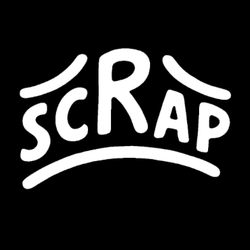

We're starting a blog to share progress on DIY freediving gear and testing. Stay tuned for updates.

This space will host:

- **Research notes** that capture experiments and the theory behind our DIY projects.
- **Updates** on builds, repairs, and anything else happening in the lab.
- **Brainstorming sessions** where we think through solutions to tricky problems.
- **Field tests** as we take prototypes into the water and report what worked (and what didn't).

<!-- more -->
