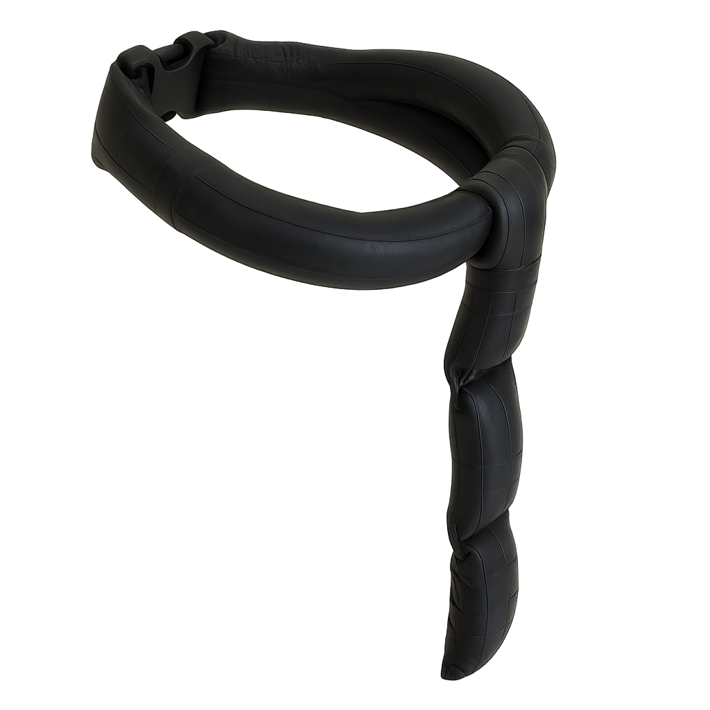
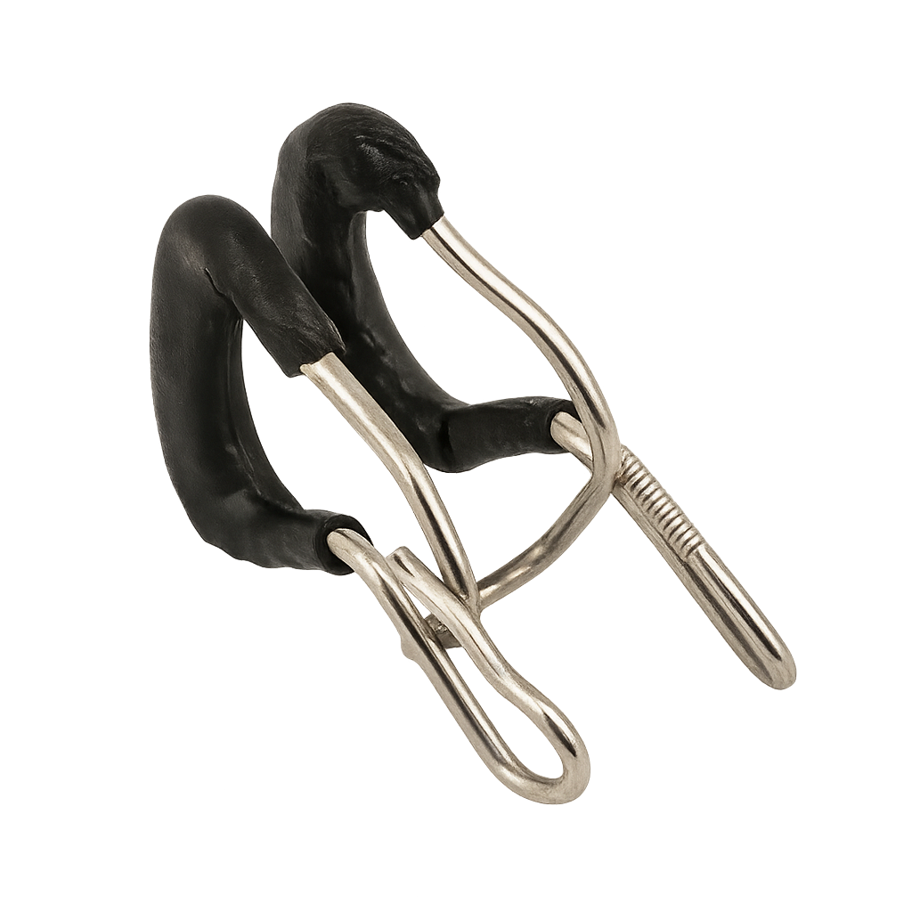

  <section class="hero-intro">
    <h1>DIY Freediving Gear</h1>
    
For the makers beneath the surface

  </section>

  <section class="hero-shields" aria-label="Featured projects">
    <article class="hero-shield">
      
      

        <h2>Carbon Short Fins</h2>
        
Total: about £135 per pair

        <a class="hero-shield__link" href="projects/short-fins/v1/power-fins/">Build your Power Fins -></a>
      

    </article>
    <article class="hero-shield">
      
      

        <h2>Modular neck weight</h2>
        
Total: about £60 for collar + module

        <a class="hero-shield__link" href="projects/neck-weight/v1/modular-lead-tube">Build your Modular Neck Weight </a>
      

    </article>
    <article class="hero-shield">
      
      

        <h2>Custom Nose Clip</h2>
        
Total: about £3 per clip

        <a class="hero-shield__link" href="projects/nose-clip/v1/bike-spoke/">Build your Nose Clip -></a>
      

    </article>
  </section>

  <section class="hero-projects-cta">
    
Ready for more? Dive into every iteration we have documented so far

    <a class="hero-projects-cta__link" href="projects/">Browse all projects &rarr;</a>
  </section>

