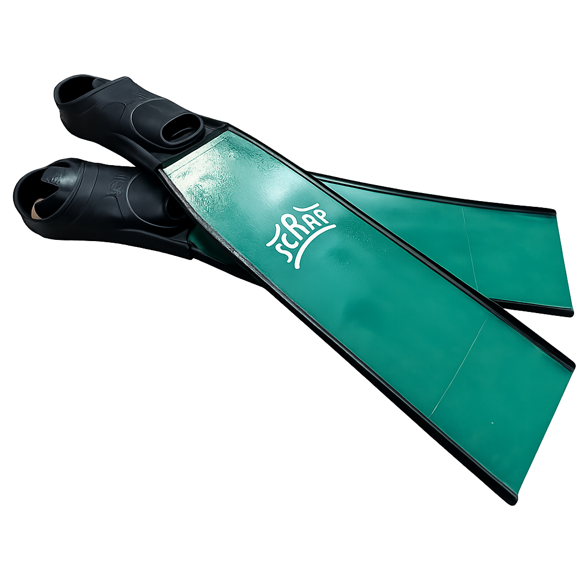

  <section class="hero-intro" data-animate="fade-up">
    <h1>DIY Freediving Gear</h1>
    
For the makers beneath the surface

  </section>

  <section class="hero-shields" aria-label="Featured projects">
    <article class="hero-shield hero-shield--concept" data-animate="fade-up">
      
      

        <h2>Carbon Long Fins</h2>
        

          Pricing TBR
          In design
        

      

    </article>
    <article class="hero-shield hero-shield--concept" data-animate="fade-up">
      
      

        <h2>Carbon Monofin Concept</h2>
        

          Pricing TBR
          In design
        

      

    </article>
    <article class="hero-shield" data-animate="fade-up">
      
      

        <h2>Modular Neck Weight</h2>
        

          from £60 / set
          <a class="hero-shield__button" href="projects/neck-weight/v1/modular-lead-tube" aria-label="Build the Modular Neck Weight project">
            Build
            →
          </a>
        

      

    </article>
    <article class="hero-shield" data-animate="fade-up">
      
      

        <h2>Carbon Training Fins</h2>
        

          from £135 / pair
          <a class="hero-shield__button" href="projects/medium-fins/v1/training-fins/" aria-label="Build the Medium Training Fins project">
            Build
            →
          </a>
        

      

    </article>
    <article class="hero-shield" data-animate="fade-up">
      
      

        <h2>Carbon Power Fins</h2>
        

          from £130 / pair
          <a class="hero-shield__button" href="projects/short-fins/v1/power-fins/" aria-label="Build the Carbon Power Fins project">
            Build
            →
          </a>
        

      

    </article>
    <article class="hero-shield" data-animate="fade-up">
      
      

        <h2>Strong-Grip Nose Clip</h2>
        

          from £3 / clip
          <a class="hero-shield__button" href="projects/nose-clip/v1/bike-spoke/" aria-label="Build the Strong-Grip Nose Clip project">
            Build
            →
          </a>
        

      

    </article>
  </section>

  <section class="hero-projects-cta" data-animate="fade-up">
    
Ready for more? Dive into every iteration we have documented so far

    <a class="hero-projects-cta__link" href="projects/">
      Browse all projects
      →
    </a>
  </section>

  

