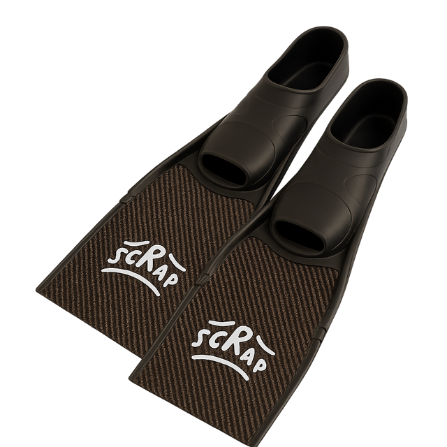

  <section class="hero-intro">
    <h1>DIY Freediving Gear</h1>
    
For the makers beneath the surface

  </section>

  <section class="hero-shields" aria-label="Featured projects">
    <article class="hero-shield">
      
      

        <h2>Carbon Short Fins</h2>
        
Total cost: about £135 per pair

        <a class="hero-shield__link" href="projects/short-fins/v1/power-fin/">Build the V1 Power Fin-></a>
      

    </article>
<!-- 
    <article class="hero-shield">
      
      

        <h2>Modular neck weight</h2>
        
Materials: about £30 per weight

        <a class="hero-shield__link" href="projects/neck-weight/index.md">Pour a balanced weight &rarr;</a>
      

    </article>

    <article class="hero-shield">
      
      

        <h2>Strong Nose Clip</h2>
        
Materials: about £7 per clip

        <a class="hero-shield__link" href="projects/future-gear/index.md#nose-clip-prototype">Follow the prototype &rarr;</a>
      

    </article>
-->
  </section>

  <section class="hero-projects-cta">
    
Ready for more? Dive into every iteration we have documented so far

    <a class="hero-projects-cta__link" href="projects/">Browse all projects &rarr;</a>
  </section>

