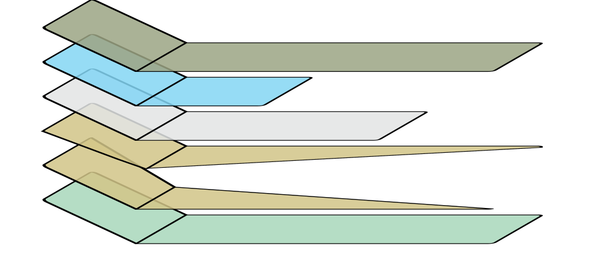
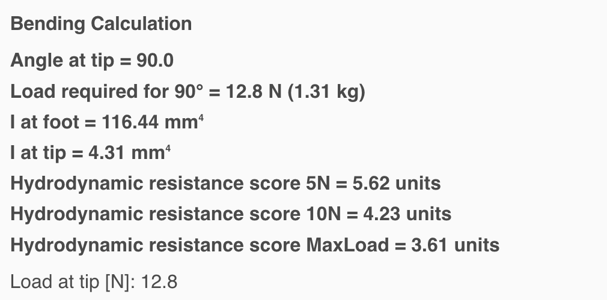

---
# {{ parent_child_title() }}
{{ status_banner() }}

Full-length competition fins, long and flexible to maximise efficiency.

## Planning

### Foot pockets ready
Make sure your foot pockets are on hand before you start. If you still need to choose a pair, follow the steps in [Choosing the foot pockets](../../../techniques/choosing-bifin-footpockets/v1/short-rails.md). Once the pockets are sorted, lay out a fresh cutting template with [Laminated paper cutting template](../../../techniques/cutting-template/v1/paper-laminate.md).

**Heads-up:** The dimensions below assume 170 mm of blade will slide into the foot pocket. Measure your pockets to confirm before cutting.

### Specifications / Dimensions
Target outline for each blade:

- **Width:** 18 cm
- **Total length:** 17 cm + 58 cm = 75 cm
    - 0–17 cm: inside the foot pocket (flat section)
    - 17–75 cm: free blade to the trailing edge

#### Layer schedule (one blade)

For this build I am going to be using a triangles to smooth the transition between the various thickness levels.

- Reserve 17 cm from the heel line for the bend zone.
- Layer 1: 20 cm × 80 cm
- Layer 2a: 20 cm × 80 cm half triangle
- Layer 2b: 20 cm × 80 cm the other half triangle
- Layer 3: 20 cm × 60 cm
- Layer 4: 20 cm × 40 cm
- Layer 5: 20 cm × 80 cm top ply


|  |  |
|-----------------------------------------|----------------------------------------------|
| Expanded Laminate View                  | Laminate Thickness Profile                   |


#### Cutting plan

For this build I am going to use carbon cloth in a different colour for the top layers in order to create a better visual effect.

|  |  |  |
|--|--------------------------------------------------------|-----------------------------------------------------------------|
|  | Cutting plan for top layers                            |  Cutting plan for the internal layers                                                               |

### Estimating the flex
Start with the [Flex predictor modelling](../../../techniques/predicting-flex/v1/tapered-cantilever-beam.md) workflow to sanity-check the layup. Adjust the layer stack and bend allowance until the predicted deflection matches your training goal.

Free blade length [mm]: 580
Blade width [mm]: 180
Layers at foot: 5
Layers at tip: 3
Min layer length [mm]: 200

|  |  |
|-------------------------------------------------|-----------------------------------------|
| Bending Calculation                             | Bending Profile                         |


Predicted:

- Load required for 90° = 11.9 N (1.21 kg)
- Hydrodynamic resistance score 5N = 5.00 units
- Hydrodynamic resistance score 10N = 3.11 units

The predicted code for this fin would be (see [hydrodynamic resistance codes](../../../techniques/encoding-fin-properties/v1/hydrodynamic-resistance-codes.md)): 
```
C580-T12-R50-F19
```

## Reference images

TODO after build

## Time needed

{{ render_project_time_breakdown() }}

## Bill of Materials
{{ render_technique_requirements_bill_of_materials() }}

## Tools Required
{{ render_technique_requirements_tools() }}

## Instructions
1. Build a 1000 mm × 600 mm laminating base following [Creating a laminating base](../../../techniques/creating-laminating-base/v3/cardboard-support.md) so both blades can be laminated at the same time.
2. Lay up the carbon according to the schedule above, using the steps in [Manual wet layup stack](../../../techniques/laminating-carbon/v1/wet-layup.md).
3. Pull the stack under vacuum to tighten the fiber volume, referencing [Edge-sealed bagging](../../../techniques/vacuum-bagging-carbon/v2/edge-sealed-bagging.md).
4. Trim the cured laminate to the template with the [Junior hacksaw method](../../../techniques/cutting-cured-carbon/v1/junior-hacksaw.md).
5. Seal the surface with the approach in [Epoxy and clear coat finish](../../../techniques/finishing-carbon/v1/epoxy-and-clear-coat.md).
6. Bond the rails using the guidance in [Marine adhesive](../../../techniques/gluing-fin-rails/v2/marine-adhesive.md).

## Results

### Desired vs Predicted vs Actual

I've recorded the flex using the [Kitchen Scale Test](../../../techniques/measuring-flex/v2/kitchen-scale-test.md).

|                     | Desired | Actual  | Notes |
|---------------------|---------|---------|-------|
| Free blade size     | 580mm   | TODO    | Ok    |
| Blade width         | 180mm   | TODO    | Ok    |
| Load for 90 degrees | 1.2kg   | TODO    | Ok    |

### Water trial

TODO after build
