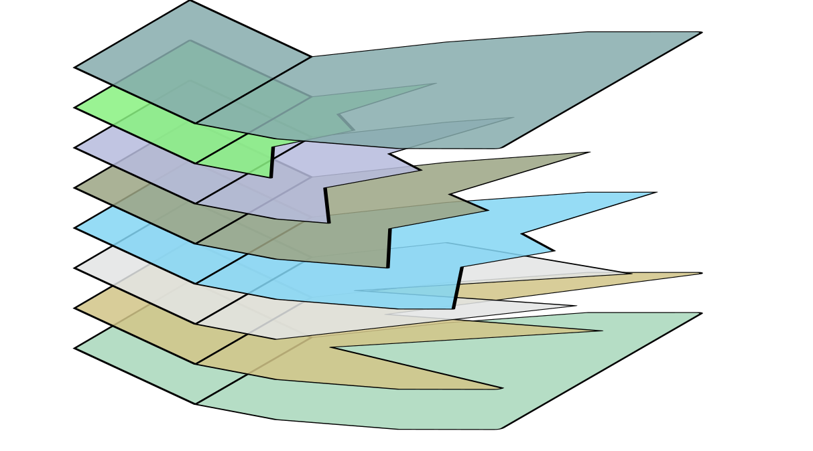
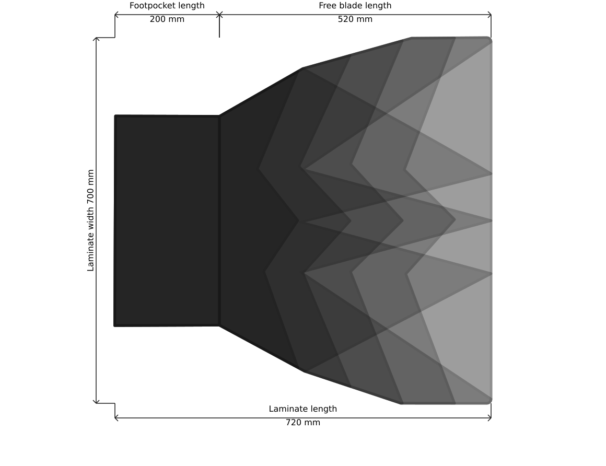
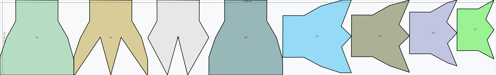
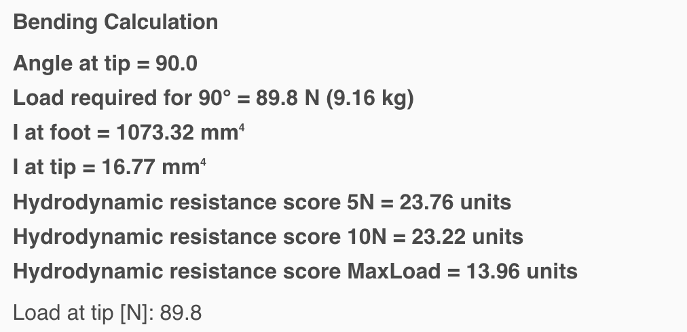
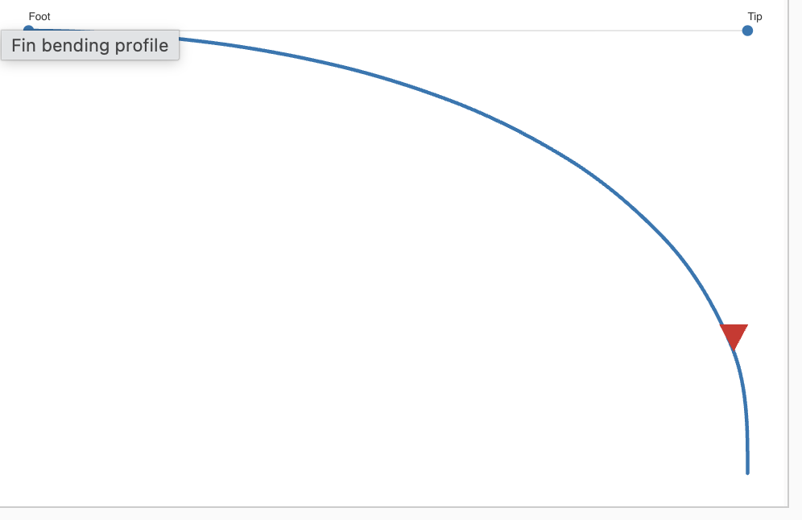

---
# {{ parent_child_title() }}
{{ status_banner() }}

Competition monofin, full-size.

## Planning

### Foot pockets ready
Make sure your foot pockets are on hand before you start. If you still need to choose a pair, follow the steps in [Choosing the foot pockets](../../../techniques/choosing-monofin-footpockets/v1/long-rails.md). Once the pockets are sorted, lay out a fresh cutting template with [Laminated paper cutting template](../../../techniques/cutting-template/v1/paper-laminate.md).

**Heads-up:** The dimensions below assume 170 mm of blade will slide into the foot pocket. Measure your pockets to confirm before cutting.

### Specifications / Dimensions
Target outline for the monofin:

- **Width:** 700 cm
- **Total length:** 17 cm + 52 cm = 69 cm
    - 0–17 cm: inside the foot pocket (flat section)
    - 17–69 cm: free blade to the trailing edge

#### Layer schedule

For this build I am going to be using a triangles to smooth the transition between the various thickness levels.

- Reserve 20 cm (17+3cm tolerance) from the heel line for the bend zone.
- Layer 1: 20 cm × 70 cm
- Layer 2: 20 cm × 70 cm cutout triangles
- Layer 3: 20 cm × 70 cm ^ mid shape triangle
- Layer 4: 20 cm x 65(-10) V side shape
- Layer 5: 20 cm x 55(-10) V side shape
- Layer 6: 20 cm x 45(-10) V side shape
- Layer 7: 20 cm x 35(-10) V side shape
- Layer 8: 20 cm × 70 cm top ply


|  |  |
|-----------------------------------------|----------------------------------------------|
| Expanded Laminate View                  | Laminate Thickness Profile                   |


#### Cutting plan

|  |  |  |
|--|---------------------------------------------------|--|
|  | Cutting plan                     |  |

### Estimating the flex
Start with the [Flex predictor modelling](../../../techniques/predicting-flex/v1/tapered-cantilever-beam.md) workflow to sanity-check the layup. Adjust the layer stack and bend allowance until the predicted deflection matches your training goal.

Free blade length [mm]: 520
Blade width [mm]: 700
Layers at foot: 8
Layers at tip: 2
Min layer length [mm]: 100

|  |  |
|-------------------------------------------------|-----------------------------------------|
| Bending Calculation                             | Bending Profile                         |

Notes: 
- As we are cutting the monofin shape, the stiffness and hydrodynamic resistance is going to be lower
- The actual bending point will move toward mid-blade as we are cutting out triangles to taper the stiffness


Predicted:
- Load required for 90° = 55.8 N (5.68 kg)
- Hydrodynamic resistance score 5N = 23.32 units
- Hydrodynamic resistance score 10N = 22.28 units

The predicted code for this monofin would be (see [hydrodynamic resistance codes](../../../techniques/encoding-fin-properties/v1/hydrodynamic-resistance-codes.md)): 
```
C520-T55-R233-F11
```

## Reference images

TODO after build

## Time needed

{{ render_project_time_breakdown() }}

## Bill of Materials
{{ render_technique_requirements_bill_of_materials() }}

## Tools Required
{{ render_technique_requirements_tools() }}

## Instructions
1. Build a 900 mm × 800 mm laminating base following [Creating a laminating base](../../../techniques/creating-laminating-base/v3/cardboard-support.md) so both blades can be laminated at the same time.
2. Lay up the carbon according to the schedule above, using the steps in [Manual wet layup stack](../../../techniques/laminating-carbon/v1/wet-layup.md).
3. Pull the stack under vacuum to tighten the fiber volume, referencing [Edge-sealed bagging](../../../techniques/vacuum-bagging-carbon/v2/edge-sealed-bagging.md).
4. Trim the cured laminate to the template with the [Junior hacksaw method](../../../techniques/cutting-cured-carbon/v1/junior-hacksaw.md).
5. Seal the surface with the approach in [Epoxy and clear coat finish](../../../techniques/finishing-carbon/v1/epoxy-and-clear-coat.md).
6. Bond the rails using the guidance in [Marine adhesive](../../../techniques/gluing-fin-rails/v2/marine-adhesive.md).

## Results

### Desired vs Predicted vs Actual

I've recorded the flex using the [Kitchen Scale Test](../../../techniques/measuring-flex/v2/kitchen-scale-test.md).

|                     | Desired | Actual  | Notes |
|---------------------|---------|---------|-------|
| Free blade size     | 580mm   | TODO    | Ok    |
| Blade width         | 180mm   | TODO    | Ok    |
| Load for 90 degrees | 1.2kg   | TODO    | Ok    |

### Water trial

TODO after build
