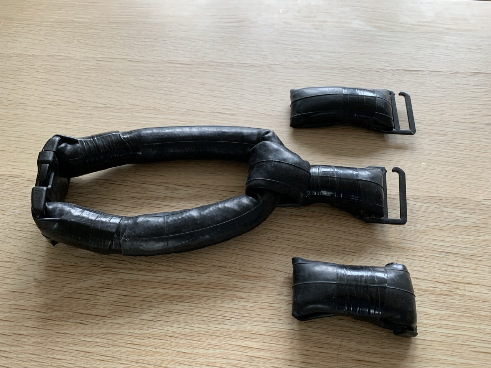

# Neck Weight v1 — Modular Lead-Filled Bike Tube Neck Weight
{{ status_banner() }}

A DIY Neck Weight with a fixed neck collar and modular additional weights.

In this example, the target weight is 4.5kg:

- 3kg neck collar
- 3x0.5kg modular weights

## Reference images

|  |  |
|-----------------------------------------|------------------------------------------|
| Neck Weight Modules                       | Neck Weight Assembled                      |

|  |  |
|-------------------------------------|------------------------------------------|
| Neck Weight Clips                   | Neck Weight Presentation                 |

## Time needed

{{ render_project_time_breakdown() }}

## Bill of Materials
{{ render_technique_requirements_bill_of_materials() }}

## Tools Required
{{ render_technique_requirements_tools() }}

## Instructions
1. Create a neck collar to serve as the base. See [Creating the Neck Collar](../../../techniques/creating-neck-collar/v1/lead-tube.md).
2. Create 3 additional modular weights to fine tune your buoyancy. See: [Creating the Modular Weights](../../../techniques/creating-modular-weights/v1/hook-buckle-inner-tube.md).
