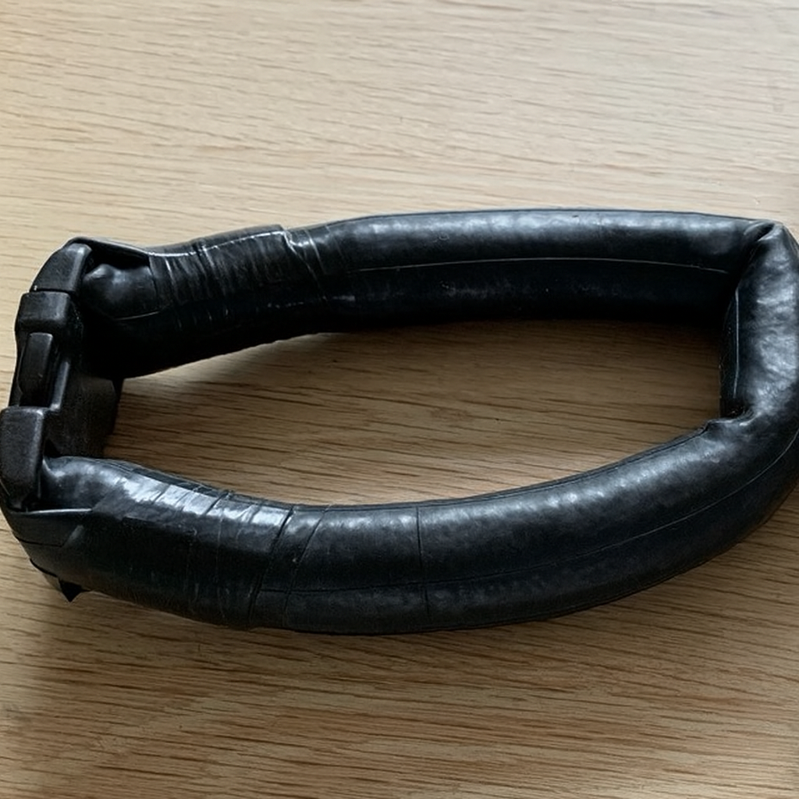

# Neck Weight v2 — Belt Loop Modular Weights on Collar
{{ status_banner() }}

Soft lead-filled collar from V1, plus an adjustable 60 mm belt with modular 500 g weights that hangs down the back.

Example setup (your numbers may vary):
- Collar: ~3.5 kg lead-filled tube
- Collar loop + buckle: ~0.5 kg
- Belt weights: 3 × 500 g = 1.5 kg
- **Total:** ~5.5 kg

## Reference images

|  |  |
|--------------------------------------------------------------------------|---------------------------------------------------------------------|
| Collar closed                                                           | Collar open                                                         |

|  |  |  |
|-------------------------------------------------------------------------------------------------------------|----------------------------------------------------------------------------------------------------------|------------------------------------------------------------------------------------------------------------|
| Components laid out                                                                                         | Belt with weights and stopper                                                                            | Finished collar with back-hanging belt                                                                     |

## Time needed

{{ render_project_time_breakdown() }}

## Bill of Materials
{{ render_technique_requirements_bill_of_materials() }}

## Tools Required
{{ render_technique_requirements_tools() }}

## Instructions
1. Build the soft neck collar following [Creating the Neck Collar](../../../techniques/creating-neck-collar/v1/lead-tube.md); target ~3 kg filled tube with quick release.  
2. Assemble the modular back belt using [Belt loop weights](../../../techniques/creating-modular-weights/v2/belt-loop-weight.md); start with three 500 g weights on a 60 mm belt and slide stopper.  
3. Clip the belt’s quick-release onto the collar loop, hang the weights down the back, and adjust count/position for comfort and buoyancy.  

## Notes
- Total weight is now split: fixed collar mass + adjustable belt weights; easy to reuse the belt weights for depth diving.  
- Ensure all buckles/stoppers are 60 mm to prevent slip.  
