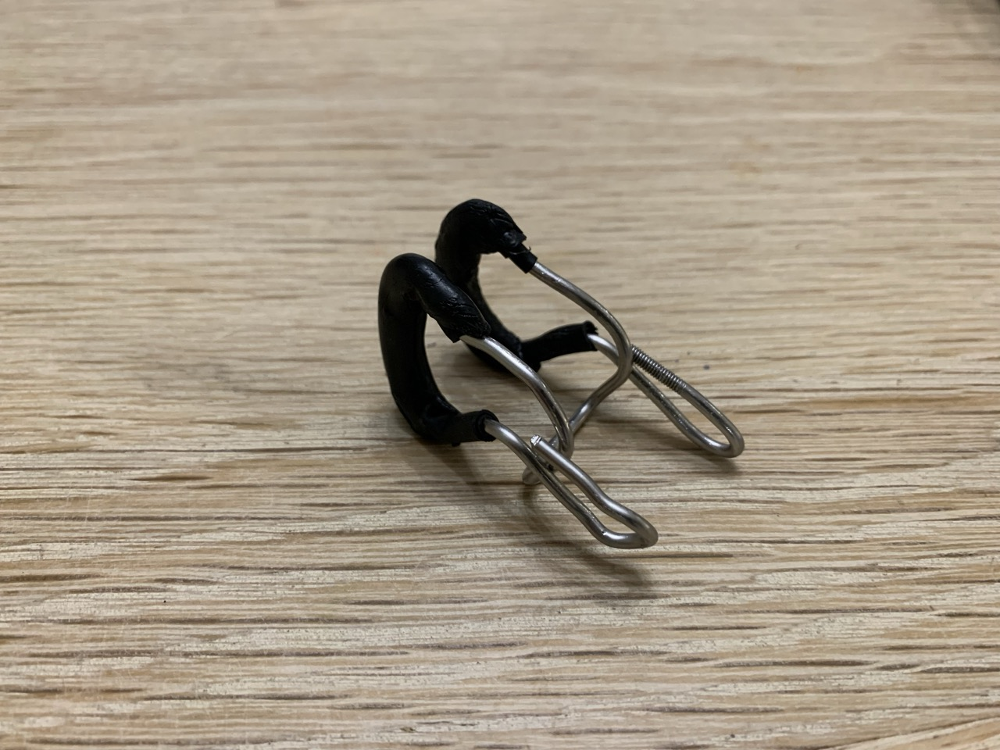

# Nose clip v1 — Bike Spoke
{{ status_banner() }}

A DIY Nose Clip you can shape exactly for your nose. Dial in the grip, tweak the pads, and get the perfect fit for your equalisation style.

## Reference images

|  |  |  |
|------------------------------------|---------------------------------------------|----------------------------|
| Formed Bike Spoke                  | Heat Shrink Tubing                          | Final Nose Clip            |

## Time needed

{{ render_project_time_breakdown() }}

## Bill of Materials
{{ render_technique_requirements_bill_of_materials() }}

## Tools Required
{{ render_technique_requirements_tools() }}

## Instructions
1. Shape the bike spoke into the nose clip base using the [Bending Steel Wire](../../../techniques/bending-steel-wire/v1/pliers.md) technique.
2. Coat the clip base using rubber in order to create a skin-friendly interface. Instructions here: [Coating Steel Wire](../../../techniques/coating-steel-wire/v1/heat-shrink-tubing.md)
3. Loop back the lever arms for a nice and compact nose clip

