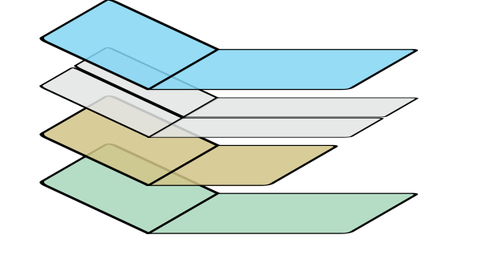
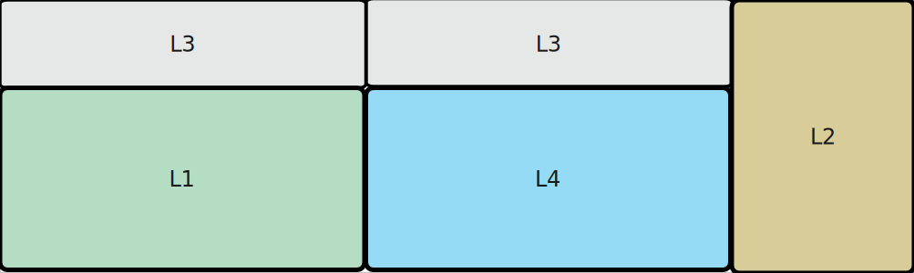
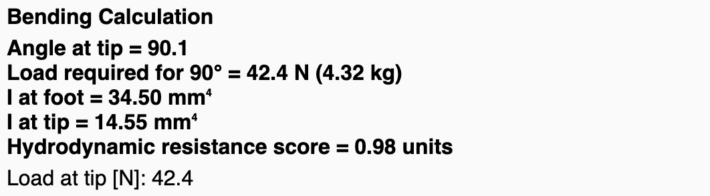
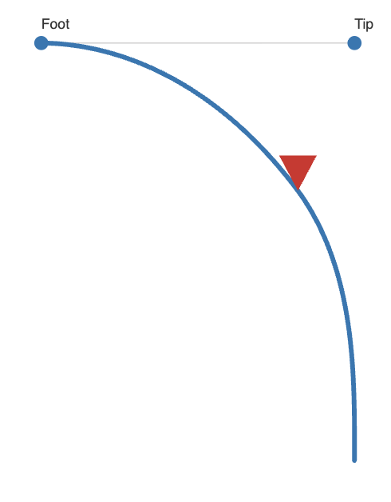
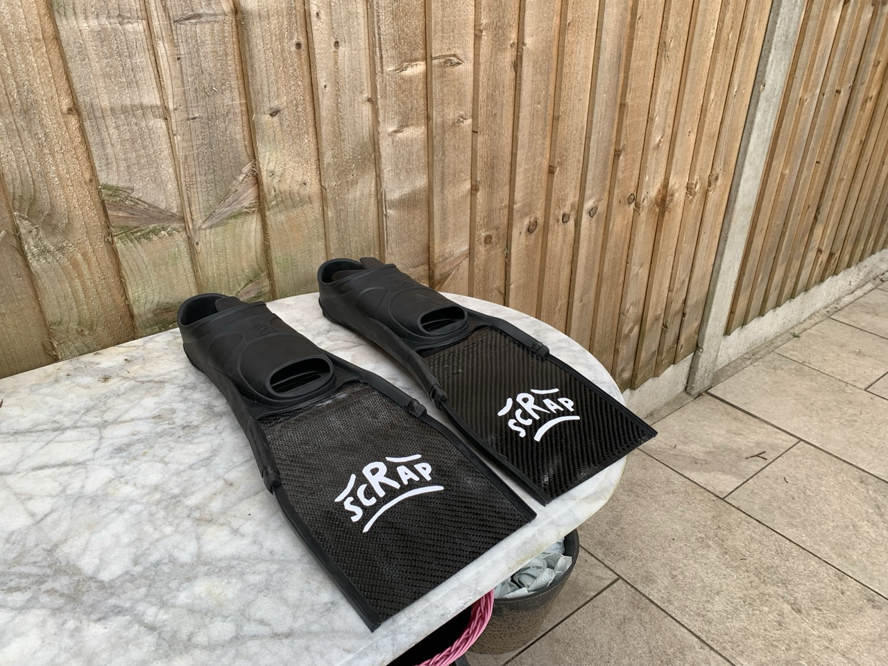
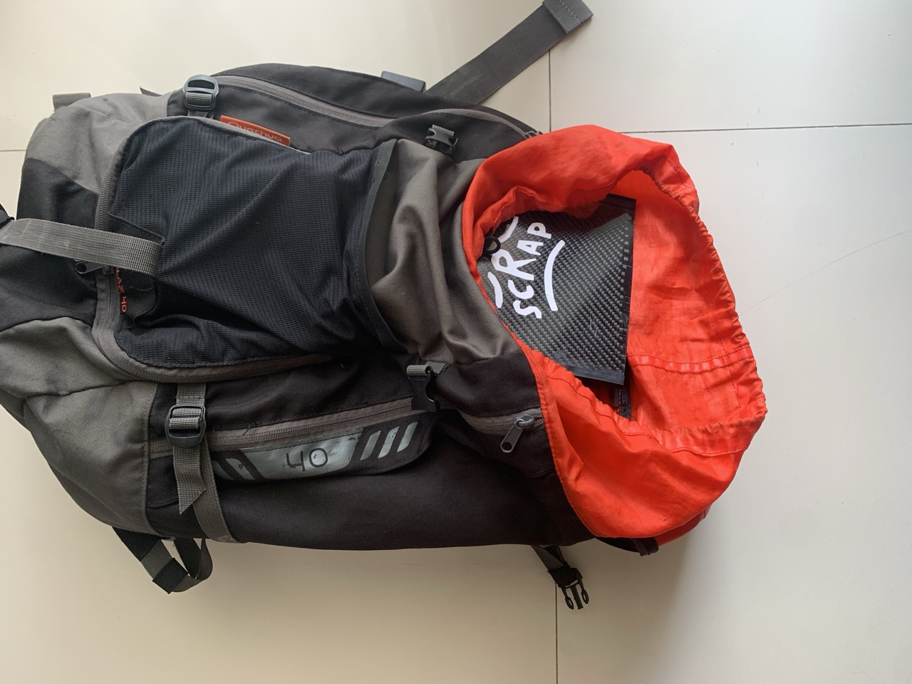

---
# {{ parent_child_title() }}
{{ status_banner() }}

Compact training fins, somewhat hard flex but with a small surface.

## Planning

### Foot pockets ready
Make sure your foot pockets are on hand before you start. If you still need to choose a pair, follow the steps in [Choosing the foot pockets](../../../techniques/choosing-bifin-footpockets/v1/short-rails.md). Once the pockets are sorted, lay out a fresh cutting template with [Laminated paper cutting template](../../../techniques/cutting-template/v1/paper-laminate.md).

**Heads-up:** The dimensions below assume 150 mm of blade will slide into the foot pocket. Measure your pockets to confirm before cutting.

### Specifications / Dimensions
Target outline for each blade:

- **Width:** 18 cm
- **Total length:** 40 cm
    - 0–15 cm: inside the foot pocket (flat section)
    - 15–23 cm: transition and bend within the rails
    - 23–40 cm: free blade to the trailing edge

#### Layer schedule (one blade)
- Reserve 15 cm from the heel line for the bend zone.
- Layer 1: 20 cm × 40 cm
- Layer 2: 20 cm × 30 cm
- Layer 3: two strips at 10 cm × 40 cm each, running along the edges for rail reinforcement
- Layer 4: 20 cm × 40 cm top ply

|  |  |
|-----------------------------------------|----------------------------------------------|
| Expanded Laminate View                  | Laminate Thickness Profile                   |

#### Cutting plan

|  |  |  |
|--|-------------------------------------------------|--|
|  | Cutting plan for one blade                      |  |

### Estimating the flex
Start with the [Flex predictor modelling](../../../techniques/predicting-flex/v1/tapered-cantilever-beam.md) workflow to sanity-check the layup. Adjust the layer stack and bend allowance until the predicted deflection matches your training goal.

|  |  |
|-------------------------------------------------|-----------------------------------------|
| Bending Calculation                             | Bending Profile                         |

Predicted:

- Load required for 90° = 35.3 N (3.60 kg)
- Hydrodynamic resistance score  5N = 2.71 units
- Hydrodynamic resistance score 10N = 2.38 units

## Reference images

|  |  |
|-------------------------------------|-------------------------------------------|
| Footpockets                         | Cured Laminate                       |

|  |  |
|---------------------------------|-------------------------------|
| Complete fins                   | Nice and compact              |

## Time needed

{{ render_project_time_breakdown() }}

## Bill of Materials
{{ render_technique_requirements_bill_of_materials() }}

## Tools Required
{{ render_technique_requirements_tools() }}

## Instructions
1. Build a 500 mm × 300 mm laminating base following [Creating a laminating base](../../../techniques/creating-laminating-base/v1/wood-support.md) so one blade can be laminated at a time.
2. Lay up the carbon according to the schedule above, using the steps in [Manual wet layup stack](../../../techniques/laminating-carbon/v1/wet-layup.md).
3. Pull the stack under vacuum to tighten the fiber volume, referencing [Enclosed bagging](../../../techniques/vacuum-bagging-carbon/v1/enclosed-bagging.md).
4. Trim the cured laminate to the template with the [Junior hacksaw method](../../../techniques/cutting-cured-carbon/v1/junior-hacksaw.md).
5. Seal the surface with the approach in [Epoxy and clear coat finish](../../../techniques/finishing-carbon/v1/epoxy-and-clear-coat.md).
6. Bond the rails using the guidance in [Two-part plastic to carbon adhesive](../../../techniques/gluing-fin-rails/v1/two-part-plastic-carbon-adhesive.md).

## Results

### Desired vs Predicted vs Actual

I've recorded the flex using the [Weight belt test](../../../techniques/measuring-flex/v1/weight-belt-test.md).

|                     | Desired  | Actual | Notes                                                                                          |
|---------------------|----------|--------|------------------------------------------------------------------------------------------------|
| Free blade size     | 250mm    | 230mm  | The footpocket side turned out bigger                                                          |
| Load for 90 degrees | 3.6kg    | 5.0kg  | Shorter blade is much stiffer                                                                  |

### Water trial

Overall the fins performed pretty well but favour a particular style of kicking:

- feels lighter than Cressi Clio 
- slightly heavier than swim training fins 
- sprinting feels good as that engages the blade properly
- feels too light (low surface area) for slow, hip-driven movements

|                     | Desired  | Actual |
|---------------------|----------|--------|
| Hydro resistance    | ~3 units | 2?     |
