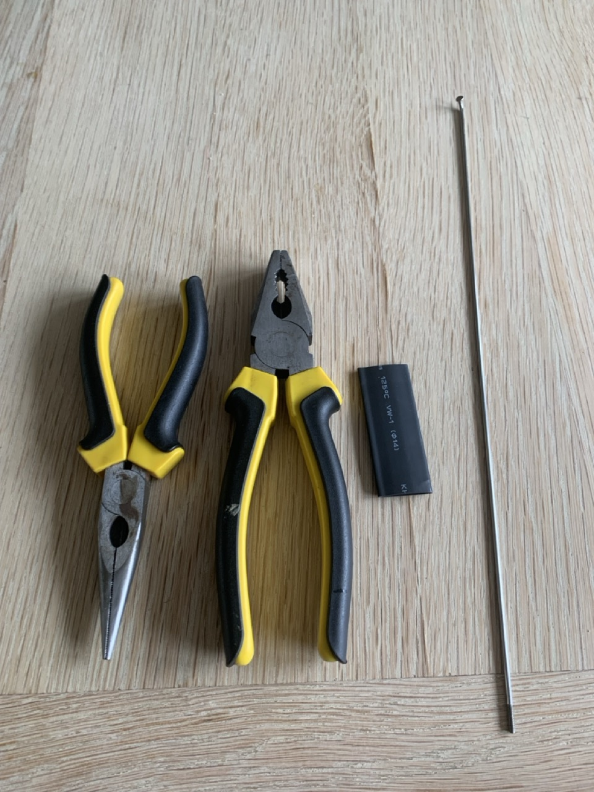
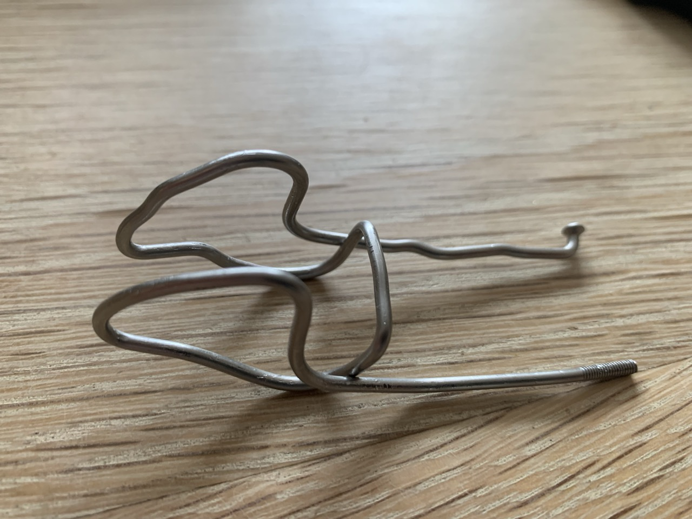

# {{ parent_child_title() }}
{{ status_banner() }}

## Goal
Bending steel wire in order to shape it in the form of a nose clip

## Specifications / Dimensions
- You need a 2mm thick steel wire (bike spoke) with a minimum length of 290mm 

## Reference Images

|  |  |
|------------------------------------|---------------------------------|
| Pliers and Bike Spoke              | Nose clip shape                 |

## Time needed

{{ render_technique_time_overview() }}

## Bill of Materials

{{ render_bill_of_materials() }}

## Tools Required

{{ render_tools_required() }}

## Instructions (step-by-step)

**Step 1 – Start from the Middle**

Begin by bending the bridge section, which will act as the spring of the clip.
Leave exactly 20 mm for the bridge.
If it’s shorter, the clip won’t fit the nose properly. If it’s longer, it won’t have enough clamping force.

**Step 2 – Form the Lever Support**

From the bridge, bend one side into a short L shape.
This L shaped section is where the lever (the closing arm) will eventually rest.

**Step 3 – Shape the Nose Pads**

Next, bend the two nose contact loops.
Use the image above as reference. They should be smooth and slightly asymmetrical so they grip evenly on both sides of the nose.

**Step 4 – Create the Lever Arm**

After shaping both nose pads, bring the wire back so that the end section rests on the L shape bridge.
This will be the lever that allows you to open and close the clip.

**Step 5 – Coat Before Final Bends**

Do not fold the lever yet.
Before finishing, coat the wire with your chosen protective layer to make it skin friendly and corrosion resistant.

**Step 6 – Final Folding**

Once the coating has fully cured, bend the lever into a compact U shape, with both legs resting neatly on the L shaped bridge.
This gives you a strong yet flexible spring action that can be adjusted slightly by bending the wire.

