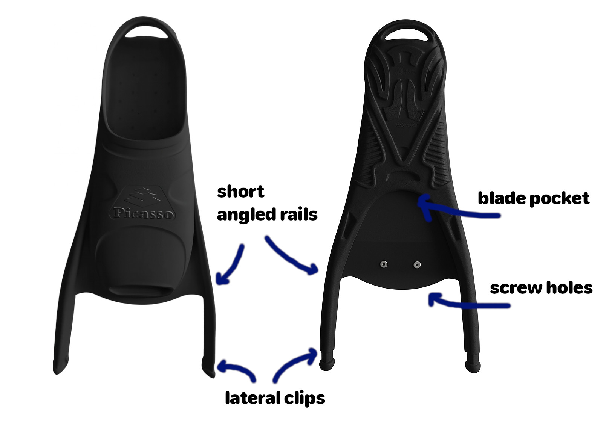
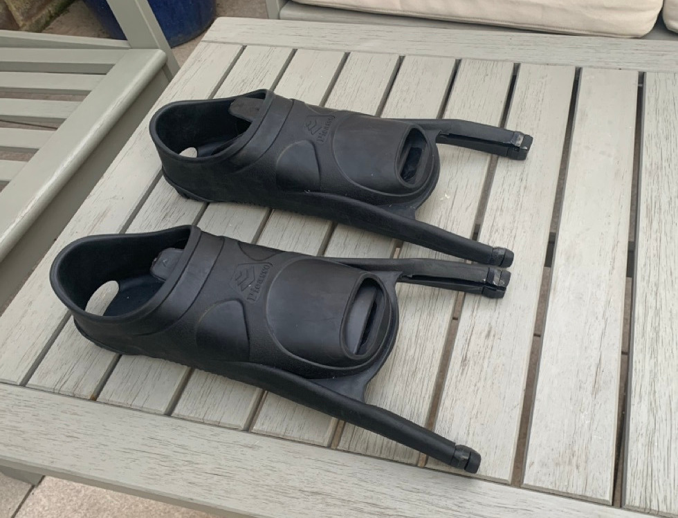

# {{ parent_child_title() }}
{{ status_banner() }}

## Goal
Choose the right freediving foot pockets for DIY carbon blades, focusing on performance-critical features.

## Specifications / Dimensions
- Foot pocket rails: **short** to allow the carbon blade to flex freely
- Blade angle: **20°–33°** for better body position and surface gliding
- Attachment system: **two-point** (blade pocket + screws) for secure hold

## Reference Images

|  |
|---------------------------------------------|
| Example Foot pocket                         |

## Instructions (step-by-step)

1. **Check rail length**

     - Choose pockets with **short or low-profile rails** so the blade can bend and return energy efficiently.
     - Avoid long or stiff rails that dampen flex, especially on short training blades.

2. **Check blade angle**

     - Select pockets with **20°–33° blade angle**.
     - Larger angles favor surface swimming and gliding.
     - Smaller angles or flat pockets may feel more responsive but are less efficient for pool or surface work.

3. **Check attachment system**

     - Ensure the pockets use a **two-point attachment**:
         - Blade slides into the pocket slot
         - Screws lock it in place
     - This system is standard for modern freediving pockets and ensures a secure, repeatable fit.

|  |
|---------------------------------------------|
| Picasso Supreme                             | 
