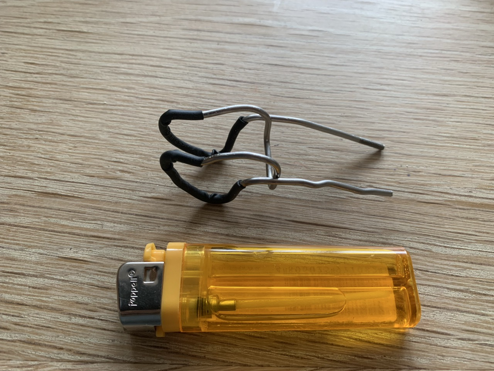

# {{ parent_child_title() }}
{{ status_banner() }}

## Goal

To make the nose clip comfortable and safe for the skin, the steel wire needs a few protective layers. 
The goal is to create a firm but soft contact surface that won’t leave marks or cause irritation.

## Reference Images

|  |  |
|-----------------------------------------------------|---------------------------------------------------|
| Heat Shrink Tubing at room temperature              | Heat Shrink Tubing after heat treatment           |

|  |  |
|-----------------------------------------------|-----------------------------------------|
| Apply Liquid Rubber                           | Let Rubber Cure                         |

## Time needed

{{ render_technique_time_overview() }}

## Bill of Materials

{{ render_bill_of_materials() }}

## Tools Required

{{ render_tools_required() }}

## Instructions (step-by-step)

**Step 1 – Add the Inner Shrink Tubing**

Slide a piece of 3.5 mm heat shrink tubing onto each of the nose contact loops.
Use a lighter to heat it evenly until it grips the wire snugly.
This gives a good base layer that holds tightly to the metal.

**Step 2 – Add the Outer Shrink Tubing**

Now slide a second layer, this time 5 mm heat shrink tubing, over the first one.
Heat it again with the lighter until it forms a firm and even surface.

At this stage the pads should feel solid but still a bit too hard. 
The only issue is that heat shrink tubing tends to leave small creases that could press uncomfortably on the nose.

**Step 3 – Smooth with Liquid Electrical Tape**

This final layer fixes that problem.
Using a small paint brush, apply liquid electrical tape over the shrink tubing.

Let it cure for about 5 minutes, then lightly shape it with your finger into a smooth, rounded surface.
Make sure the contact area that touches the nose is perfectly smooth and seamless.

**Step 4 – Let It Cure**

Leave the coated clip to cure for at least 12 hours before testing it.
Once fully cured, the surface should be flexible, grippy, and comfortable to wear.

|  |
|-------------------------------------|
| Complete Nose Clip                  |