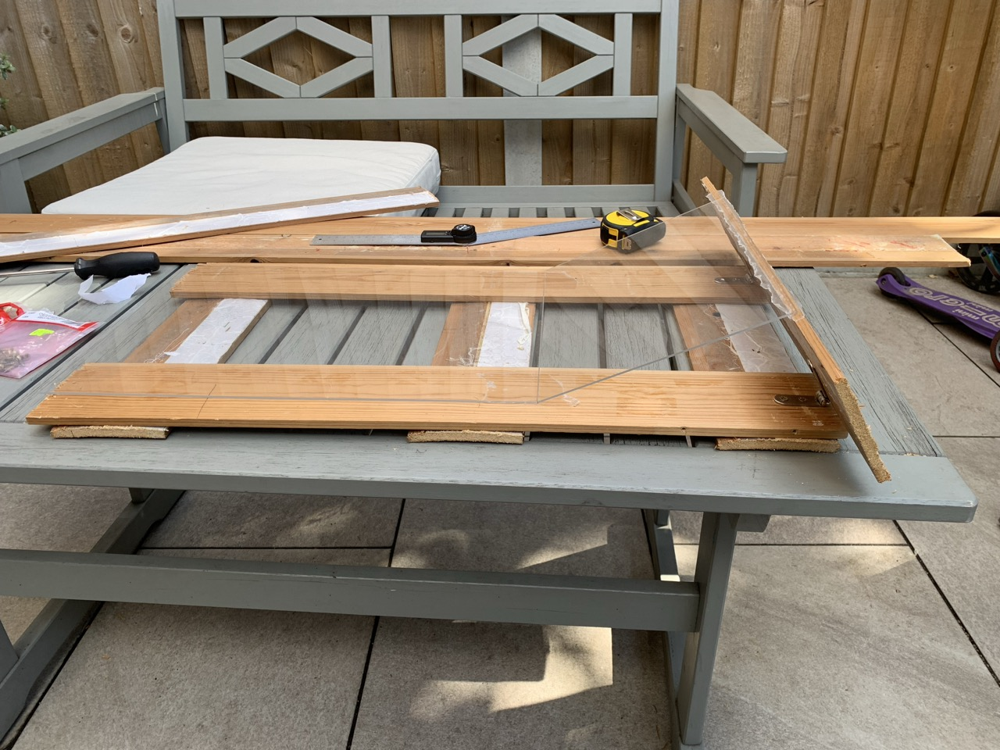
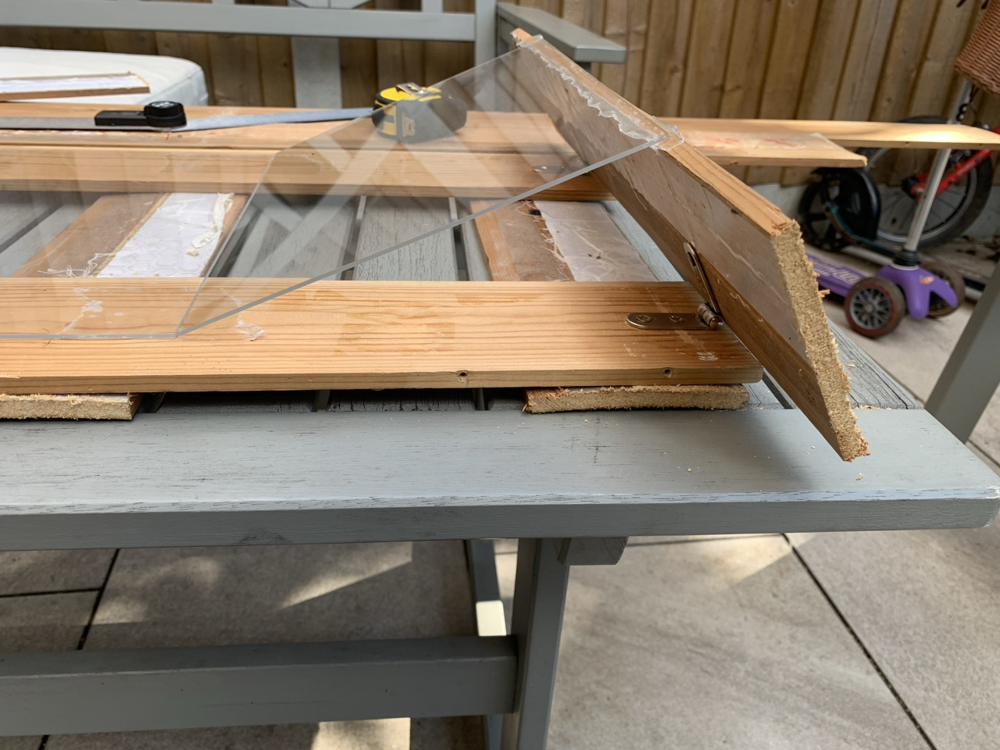

# {{ parent_child_title() }}
{{ status_banner() }}

25° wooden base with acrylic sheets for laminating carbon fin blades.

## Goal
Create a rigid angled surface to support fin blades during lamination.

## Specifications / Dimensions

**Dimensions**

- **Long Side (Flat)**:
    - Minimum width: **25cm** (to accommodate 20cm blade width and additional room).
    - Minimum length: **30cm** (to fit a 25cm blade length and additional room).
- **Angled Side (23°–25° Incline)**:
    - Angle: **23 degrees** (or 25° based on matching geometry).
    - Minimum width: **25cm** (to match blade width).
    - Minimum length: **20cm** (to fit 15cm blade length and extra space).

## Bill of Materials

{{ render_bill_of_materials() }}

## Tools Required

- **Cutting Tools:** Wood saw.
- **Assembly Tools:** Screwdriver and screws for securing brackets.
- **Measurement and Finishing:** Measuring tools (square, protractor, tape measure). Sandpaper for smoothing wood edges.

## Reference Images 

|  |  |
|----------------------------------------|--------------------------------------------|
| Full Support Structure                 | Brackets and Side Supports                 |

## Instructions (step-by-step)

1. **Base Construction**
    - Use 1cm thick timber to create a solid base.
    - Cut wooden side supports to a **23°–25° angle** to replicate blade geometry.
    - Secure side supports to the flat base using **metal brackets** for rigidity.

2. **Laminating Platform**
    - Tape clear **Acrylic Perspex sheets** (A3 and A4 sizes) onto the wooden base using thin **double-sided adhesive
      tape**.
    - Ensure the surface is smooth and taut to properly press against the blade.

## Data to Record / Results
- Notes on surface flatness after cure
- Any deformation or movement during lamination

## Limitations

- **Does not scale well**: In order to create bigger fins, the wooden structure needs to be re-worked.
- **Vacuum Bag Fit**: Ensure the base with acrylic layers fits entirely into the vacuum bag.
- **Air Trapping Issue**: The gap between the angled section and wooden supports bends the acrylic during vacuum bagging
