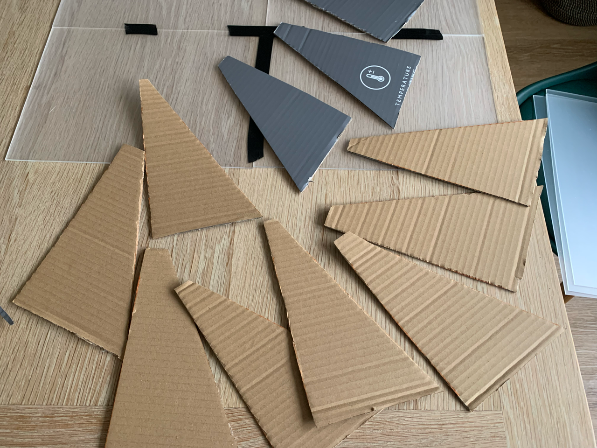
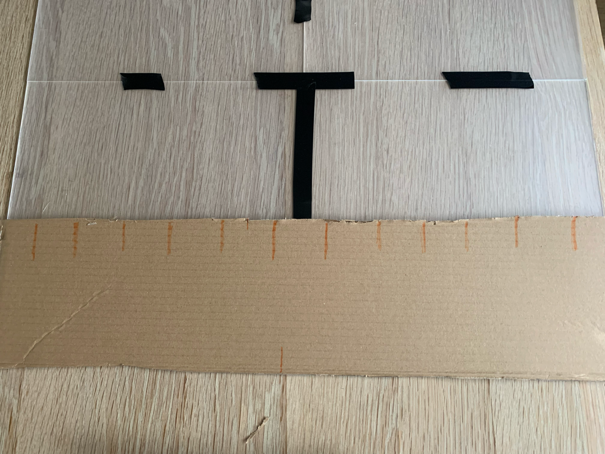
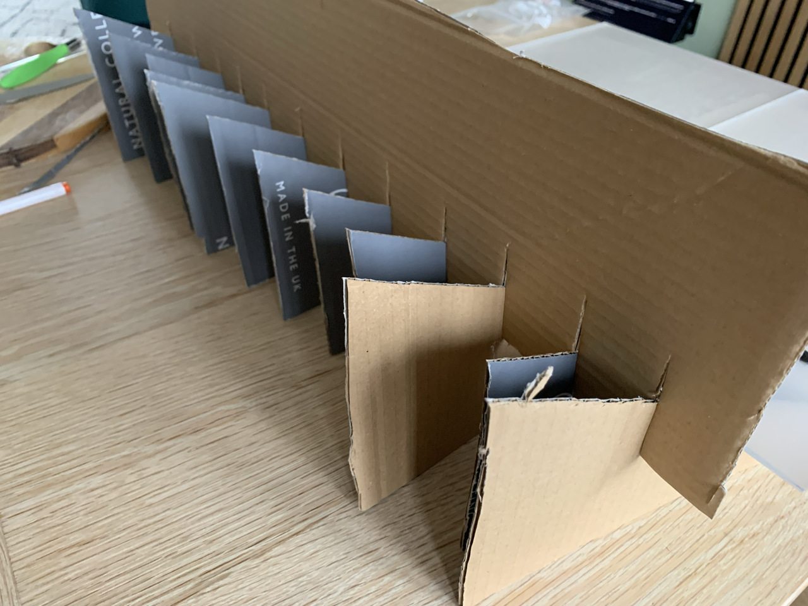
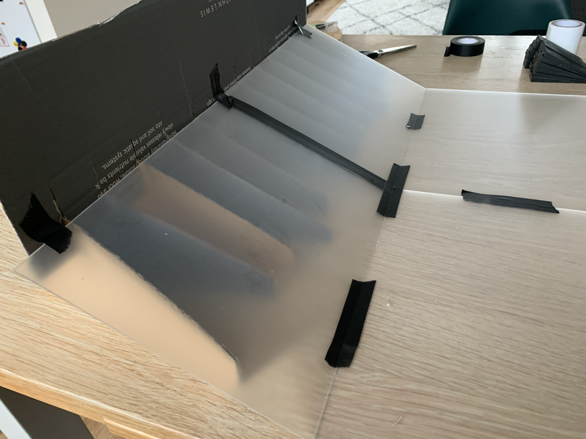

# {{ parent_child_title() }}
{{ status_banner() }}

## Goal
Provide a modular surface with adjustable wedges to support blades during lamination.

## Specifications / Dimensions
- **Target working area:** ~60 × 90 cm  
- **Purpose:** Provides enough surface for a two long fins plus sealing margin  
- **Support requirement:** Must be placed on a **flat, rigid surface** such as a table or workbench  
- **Protection:** Place a **plastic sheet** under the base to protect the table surface  

## Reference Images

|  |  |
|------------------------------------------|---------------------------------------------------|
| Cardboard Wedges                         | Cardboard Stabiliser                              |

|  |  |
|---------------------------------------------------------------------|------------------------------------------------|
| Cardboard Stabiliser In Place                                       | Cardboard Support Final                        |

## Time needed

{{ render_technique_time_overview() }}

## Bill of Materials

{{ render_bill_of_materials() }}

## Tools Required
{{ render_tools_required() }}

## Instructions (step-by-step)
1. **Prepare the surface**  
     - Place a plastic sheet on a flat, rigid table or bench.  
     - Ensure there is no dust or debris under the plastic.  

2. **Arrange acrylic sheets**  
     - Flat blade section: 4 A3 sheets in a 2 × 2 layout (~59 × 84 cm).  
     - Footpocket section: 2 A4 sheets side by side (cut one A3 sheet).  

3. **Join sheets**  
     - Clean edges with isopropyl alcohol.  
     - Bridge each joint with electrical tape
     - Press tape firmly to remove trapped air and keep surface flush.  

4. **Add wedge supports**  
     - From cardboard, cut about 12 triangles angled at 27 degrees, long enough to support the footpocket section
     - Join the supporting triangles with a horizontal cardboard stabiliser strip to keep them in place
     - Place the cardboard wedge under the footpocket section and secure in place with a bit of tape  

## Benefits
- Apart from the sheets, the materials are inexpensive
- This version does not require a heavy wooden support structure, making it much easier and faster to put together.
- Modular design — acrylic sheets and wedges can be stored flat and reused for different versions.

## Limitations
- The base cannot be placed as a whole into a vacuum bag.
- The only viable vacuum method is sealing the edges of the bag around the acrylic surface, which is less flexible than a solid one-piece base.
