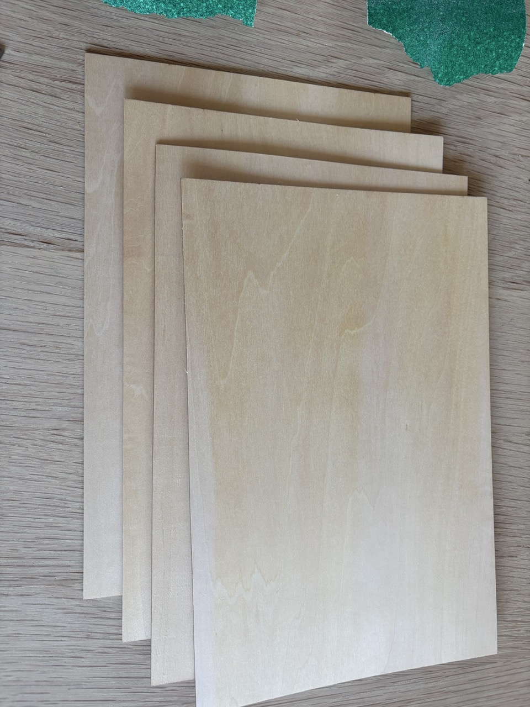
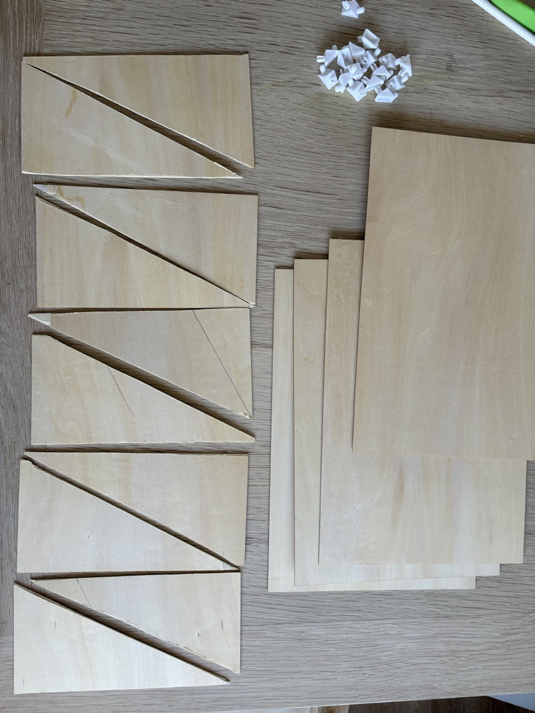
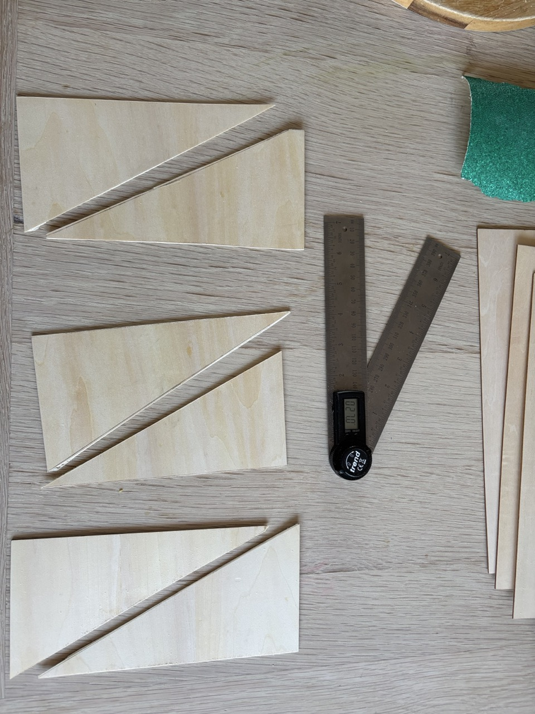
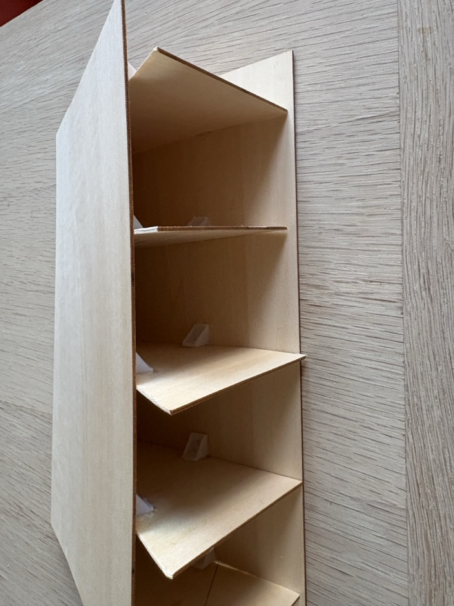
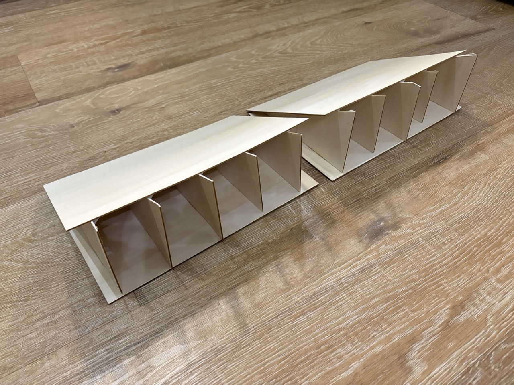
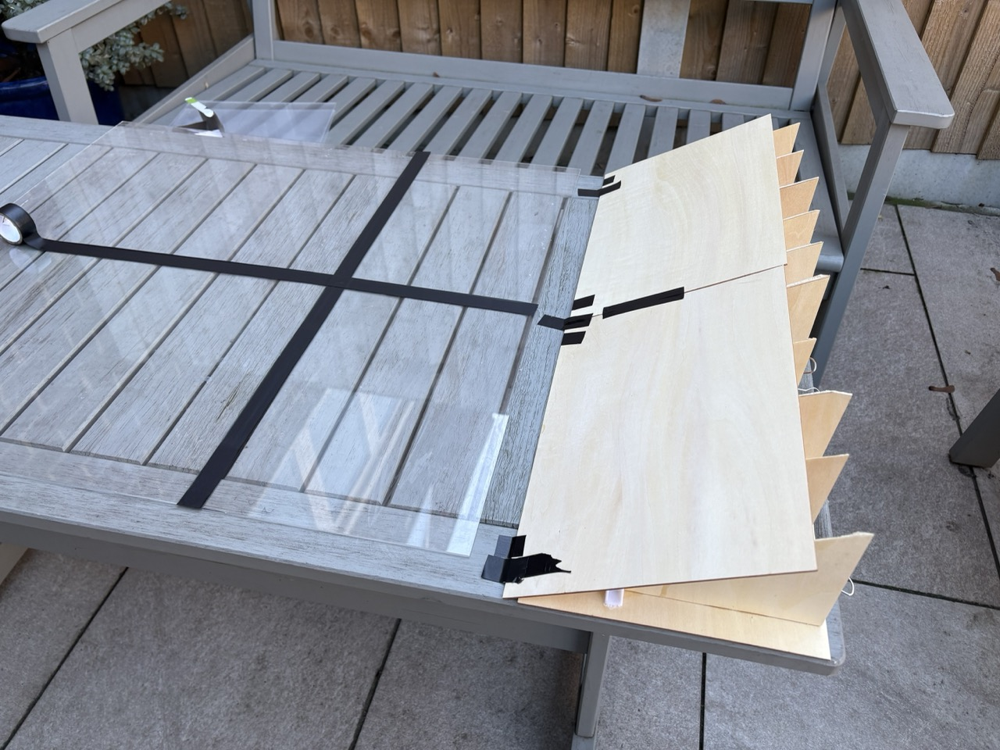

# {{ parent_child_title() }}
{{ status_banner() }}

27° plywood wedge held with plastic corner braces to support the footpocket section of the laminating base.

## Goal
Create a rigid, low-cost angled support that is quicker to assemble than cardboard and more stable than loose plastic wedges.

## Specifications / Dimensions
- **Target working area:** ~60 × 90 cm on the acrylic sheet surface  
- **Wedge angle:** 27° for the footpocket rise  
- **Wedge footprint:** ~30 × 60 cm under the footpocket section; add a second wedge if you need more width  
- **Support requirement:** Must sit on a **flat, rigid surface** such as a bench  

## Reference Images

|  |  |  |
|--------------------------------------|----------------------------------------|-------------------------------------------|
| Materials                            | Triangles cut                          | Supports dry-fit                          |

|  |  |  |
|---------------------------------------|----------------------------------------|-------------------------------------------|
| Gluing braces                         | Plywood wedge                          | In use under acrylic                      |

## Time needed

{{ render_technique_time_overview() }}

## Bill of Materials

{{ render_bill_of_materials() }}

## Tools Required
{{ render_tools_required() }}

## Instructions (step-by-step)

### Build the wedge
1. **Cut the plywood wedges**  
     - Mark 27° on the plywood sheets with the protractor/angle finder.  
     - Cut matching right triangles (only to optimise cutting; a single layer is sufficient).  

2. **Brace the triangles**  
     - Lightly roughen brace contact faces.  
     - Super-glue corner braces to join adjacent triangles, keeping the 27° face true.  

3. **Finish the wedge edge**  
     - Align the triangle hypotenuses so the long edge is continuous.  
     - Trim or re-glue any pieces until the edge is straight and sits flat without gaps.  

4. **Position the wedge**  
     - Set the wedge beneath the footpocket section; ensure braces sit fully on the flat bench.  
     - Check the angle with the protractor; adjust or re-glue before loading weight.  

### Lay the acrylic surface
1. **Arrange acrylic sheets**  
     - Flat blade section: 4 A3 sheets in a 2 × 2 layout (~59 × 84 cm).  
     - Footpocket section: 2 A4 sheets side by side (cut one A3 sheet).  

2. **Join sheets**  
     - Tape the seams with electrical tape, keeping the surface flush (wipe edges first if needed).  

## Benefits
- More rigid and repeatable than cardboard, still inexpensive and lightweight.
- Quick build with only a craft knife, glue, and braces; no sawing required.
- Reusable; swap wedges if they become fouled with epoxy drips.

## Limitations
- Higher material cost than cardboard, but the wedge is highly reusable and durable.
- Angle is fixed once glued; changing angles means cutting a new set of triangles.
- Super glue bonds can be brittle if heavily flexed; avoid large point loads on a single brace.
