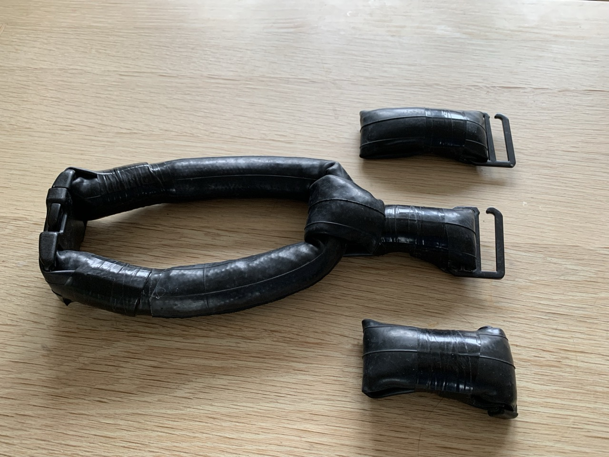
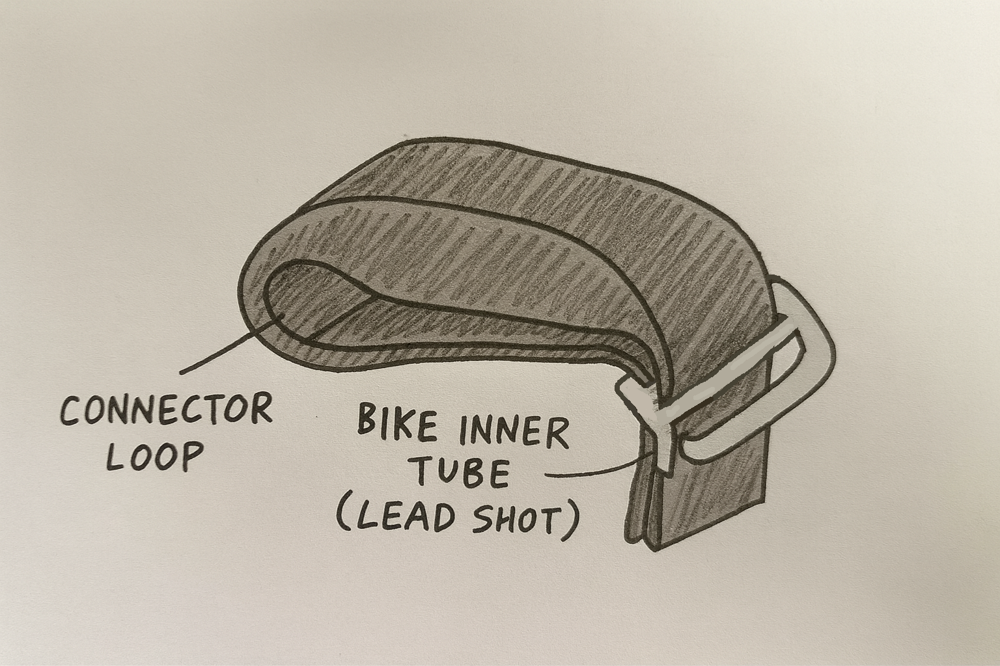
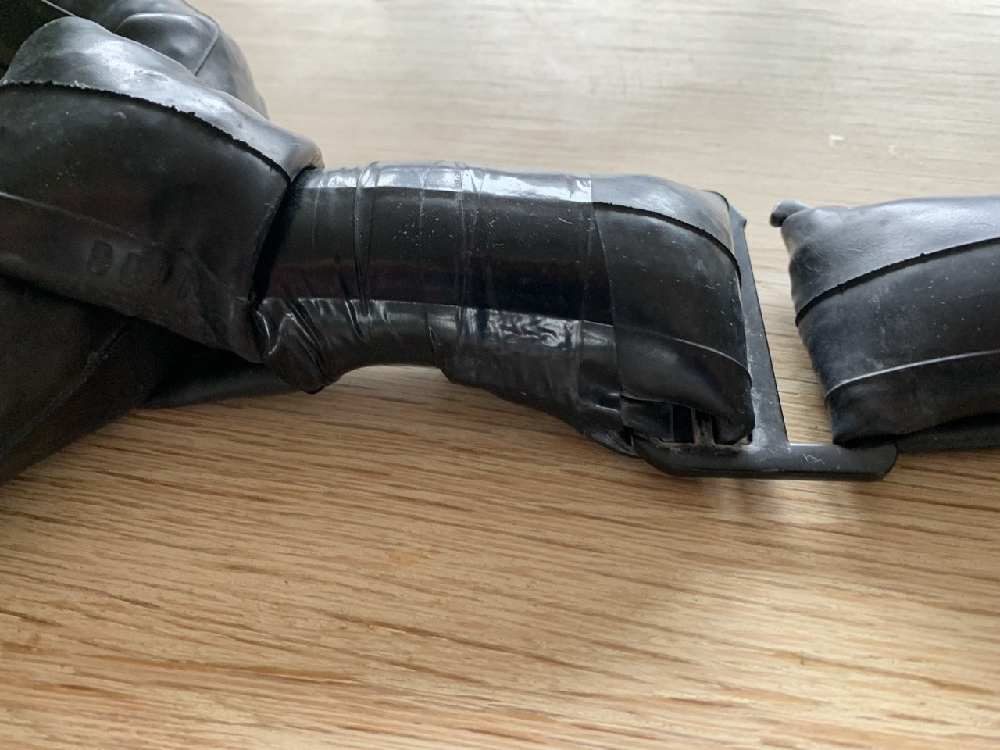

# {{ parent_child_title() }}
{{ status_banner() }}

## Goal

To make tiny 0.5kg modular weights that can be composed to achieve a target weight.
The instructions are for making one module, repeat for multiple modules.

## Reference Images

|  |  |
|--------------------------------------|------------------------------------|
| Weight Hook Buckle                   | Weight Modules                     |

|  |  |
|--------------------------------------------|-----------------------------------------------|
| Connector Loop                             | Joining with Neck Collar - Detail             |

## Time needed

{{ render_technique_time_overview() }}

## Bill of Materials

{{ render_bill_of_materials() }}

## Tools Required

{{ render_tools_required() }}

## Instructions (step-by-step)

**Step 1 – Prepare the Tube**

Take a section of bike inner tube long enough to handle comfortably.
Slide one end through the middle slot of the G-buckle, fold it back, and hold it in place with your hand.
This will form the buckle end of the module.

**Step 2 – Fill with Lead Shots**

Pour about 500 g of lead shots into the open end of the tube.
Keep holding the buckle end so it doesn’t slip.
Tap the tube lightly as you fill to help the shots settle evenly.

**Step 3 – Form the Loop**

Fold the other end of the tube to make a small loop.
If this module will attach to the main neck collar, connect it now using the loop.
If it’s a middle module, leave the loop free for later connection.

**Step 4 – Thread the Buckle**

Feed the end of the tube through the first slot of the G-buckle, leaving the third slot open.
Fold both ends neatly against the body of the weight module.

**Step 5 – Secure and Cut**

Wrap several tight turns of electrical tape over both folded ends and around the buckle area.
Make sure the tape holds firmly and covers all sharp edges.
When everything feels secure, cut off any excess tube and tidy up the ends.
The finished module should feel compact, smooth, and ready to connect.
