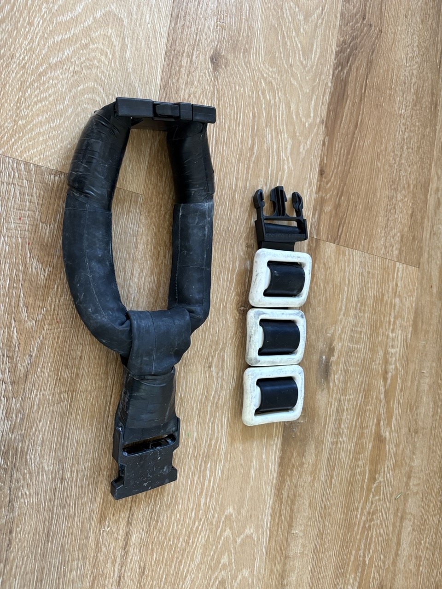
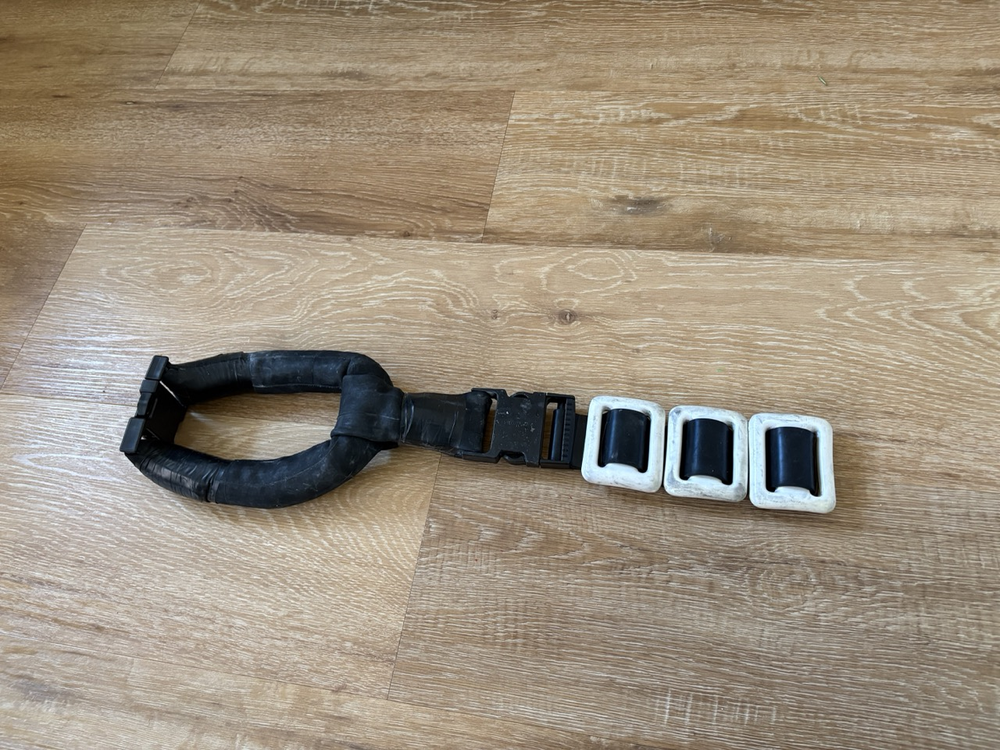
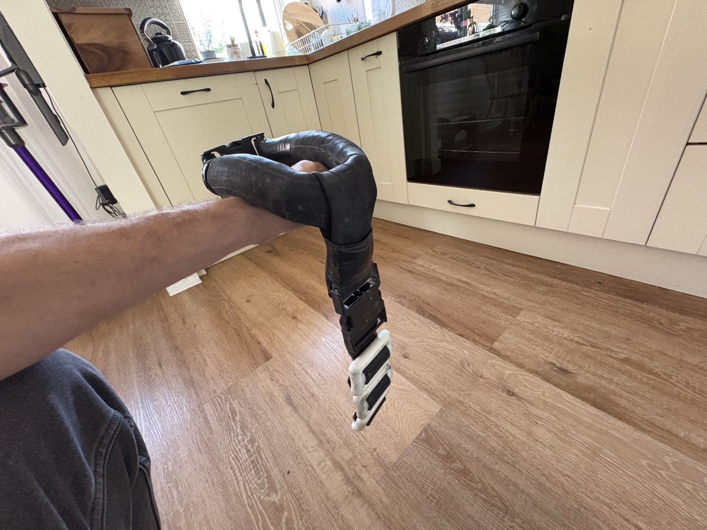

# {{ parent_child_title() }}
{{ status_banner() }}

## Goal
Add adjustable back-hanging ballast that clips into the existing neck-collar loop, using a 60 mm belt with removable 500 g weights.

## Reference Images

|  |  |  |
|-------------------------------------------|----------------------------------------------|-----------------------------------|
| Components laid out                       | Belt threaded with weights                   | Finished collar                   |

## Time needed

{{ render_technique_time_overview() }}

## Bill of Materials

{{ render_bill_of_materials() }}

## Tools Required
{{ render_tools_required() }}

## Instructions (step-by-step)
1. **Make the collar attachment**  
     - Cut a short inner-tube loop sized to clip onto the neck collar ring (from [Neck collar – Lead tube](../../creating-neck-collar/v1/lead-tube.md)).  
     - Thread both ends through the 60 mm quick-release buckle and close it. This loop is only an anchor point, not a neck strap.  

2. **Thread the belt**  
     - Pass the 60 mm belt through the buckle that hangs from the collar attachment.  
     - Slide on three 500 g weights, clustering them near the buckle end so they sit between shoulder blades.  

3. **Lock the weights**  
     - Add the 60 mm slide stopper after the last weight to keep the stack from shifting.  

4. **Fit and adjust**  
     - Wear the neck collar, clip in the belt, and snug so weights rest along the upper back.  
     - Add or remove 500 g weights to hit your target total; the same weights can be reused for depth diving.  

## Benefits
- Fully modular: change total weight by adding/removing standard dive weights.
- Hangs down the back for better weight distribution and comfort.
- Reuses common belt hardware; easy to repair or replace parts.

## Limitations
- Ensure buckle and stopper are true 60 mm; mismatched sizes can slip.
