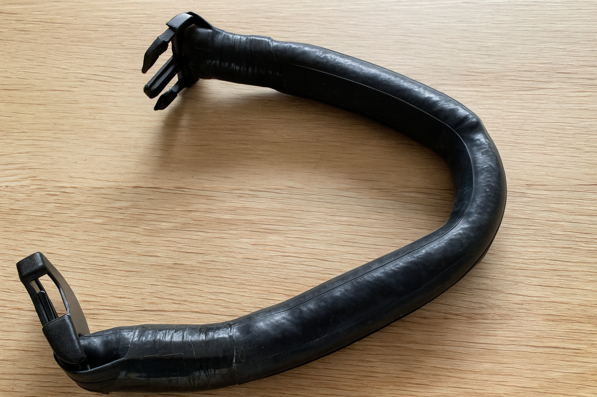
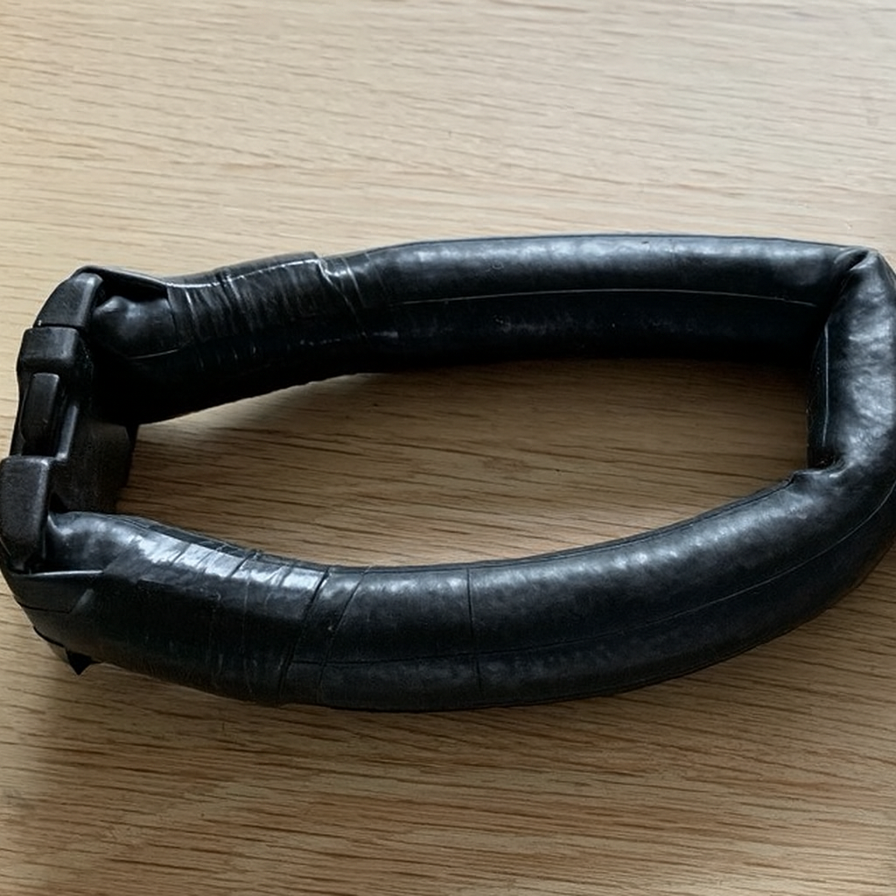

# {{ parent_child_title() }}
{{ status_banner() }}

## Goal

To make a neck weight collar that fits comfortably around the neck and can be release quickly for safety.

## Reference video

https://www.youtube.com/watch?v=4JpFWPSaKNs

## Reference Images

|  |  |
|----------------------------------|-----------------------------|
| Neck Collar Open                 | Neck Collar Closed          |

## Time needed

{{ render_technique_time_overview() }}

## Bill of Materials

{{ render_bill_of_materials() }}

## Tools Required

{{ render_tools_required() }}

## Instructions (step-by-step)

**Step 1 – Add the First Buckle**

Cut one end of the bike inner tube and slide a buckle inside.
Fold the tube back through the buckle and secure it tightly with electrical tape.
This will form one end of the neck collar.

**Step 2 – Fill with Lead Shots**

Pour lead shots into the open end of the tube until you reach the target weight.
Work slowly so the tube fills evenly and no air pockets remain.
Make sure the tube stays soft and flexible when filled.

**Step 3 – Check the Size**

Getting the fit right is the most important part.
Slide a second buckle onto the open end but do not tape it yet.
Hold it closed and try the weight around your neck.

If it feels loose, remove a small amount of lead.
If it feels tight, loosen the buckle until it sits comfortably.

**Step 4 – Secure the Second Buckle**

Once the size feels right, tape the second buckle securely.
Wrap several tight turns of electrical tape so it will not slip.

**Step 5 – Finish the Surface**

Use more electrical tape to cover all joins and seams.
Make sure the surface is smooth and nothing can rub against the skin.
A clean finish helps the collar sit comfortably during dives.
