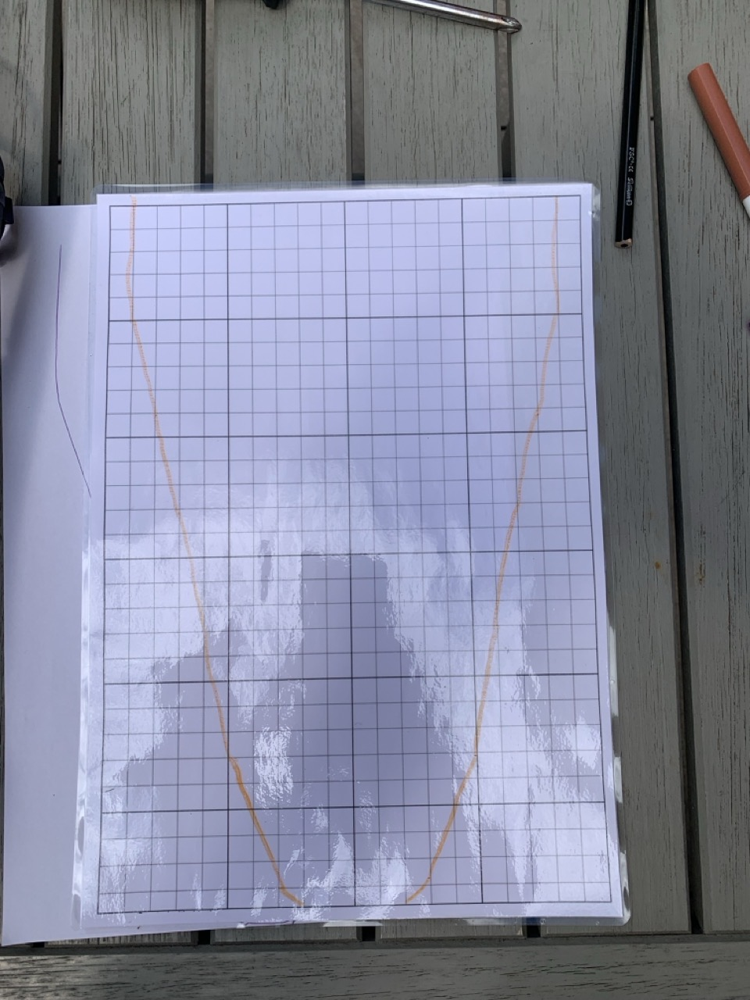

# {{ parent_child_title() }}
{{ status_banner() }}

## Tools Required
{{ render_tools_required() }}

This technique shows how to create a cutting template for fins using laminated paper.

## Goal
Produce a durable template that matches the foot pocket outline.

## Specifications / Dimensions
- Sized to the chosen foot pocket and blade design

## Bill of Materials

{{ render_bill_of_materials() }}

## Reference Images

|  |  |  |
|-------------------------------------------|----------------------------------------------------|----------------------------------------------------
| Paper Template Traced                     | Cutting Template Back                              | Cutting Template Front                                 

## Instructions (step-by-step)
1. **Print the Template**
     - Print the provided A4 graph paper: [Download the Graph Paper](./graph_paper.pdf)
2. **Laminate the Paper**
     - Apply lamination film or clear adhesive sheets to both sides for durability.
     - Smooth the film to avoid air bubbles and ensure it adheres properly.
3. **Trace an approximate contour**
     - Look at the foot pocket and trace an approximate contour (precision comes later).
4. **Cut the Template**
     - Carefully cut along the traced outline using scissors.
     - Make sure the edges are smooth and well-defined.
5. **Verify the Template**
     - Try to fit the template into a foot pocket.
     - Adjust any rough edges to ensure accuracy.

## Limitation
- Laminated paper is not stiff enough and might warp when pushed into the foot pocket

