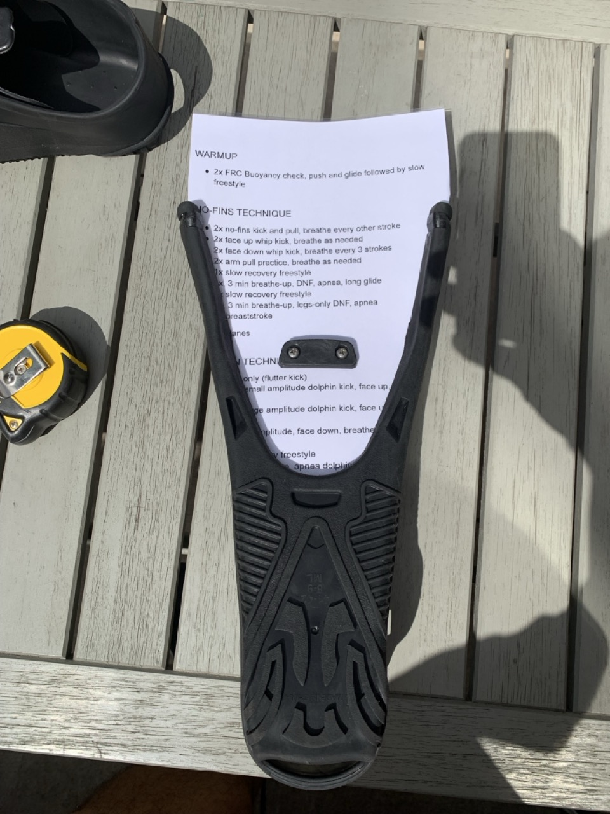

# Cutting template v1 — paper laminate
{{ status_banner() }}

This technique shows how to create a cutting template for fins using laminated paper.

## Goal
Produce a durable template that matches the foot pocket outline.

## Specifications / Dimensions
- Sized to the chosen foot pocket and blade design

## Materials / Bill of Materials
- Paper sheets (standard or heavy-duty for added stiffness)
- Lamination film or clear adhesive sheets

## Tools Required
- Scissors or precision cutting tool
- Pen or pencil for tracing

## Instructions (step-by-step)
1. **Print the Template**
   - Print the provided A4 graph paper: [Download the Graph Paper](./graph_paper.pdf)
2. **Laminate the Paper**
   - Apply lamination film or clear adhesive sheets to both sides for durability.
   - Smooth the film to avoid air bubbles and ensure it adheres properly.
3. **Trace an approximate contour**
   - Look at the foot pocket and trace an approximate contour (precision comes later).

|          |          |  |          |          |
|----------|----------|-------------------------------------------|----------|----------|

4. **Cut the Template**
   - Carefully cut along the traced outline using scissors.
   - Make sure the edges are smooth and well-defined.
5. **Verify the Template**
   - Try to fit the template into a foot pocket.
   - Adjust any rough edges to ensure accuracy.

|  |  |
|----------------------------------------------------|----------------------------------------------------|
| Cutting Template 1                                 | Cutting Template 2                                 |

## Limitation
- Laminated paper is not stiff enough and might warp when pushed into the foot pocket

