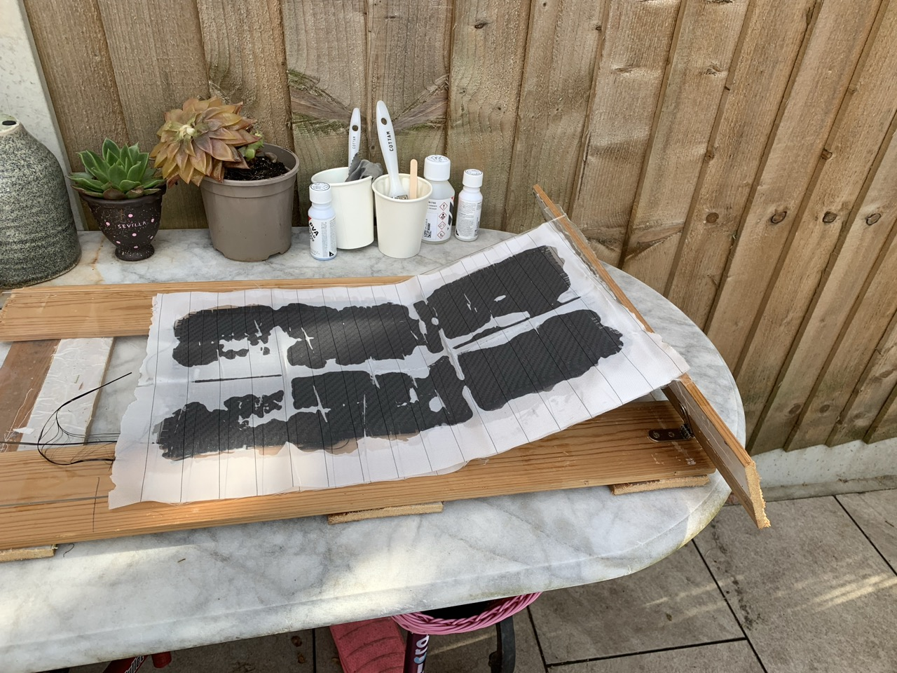
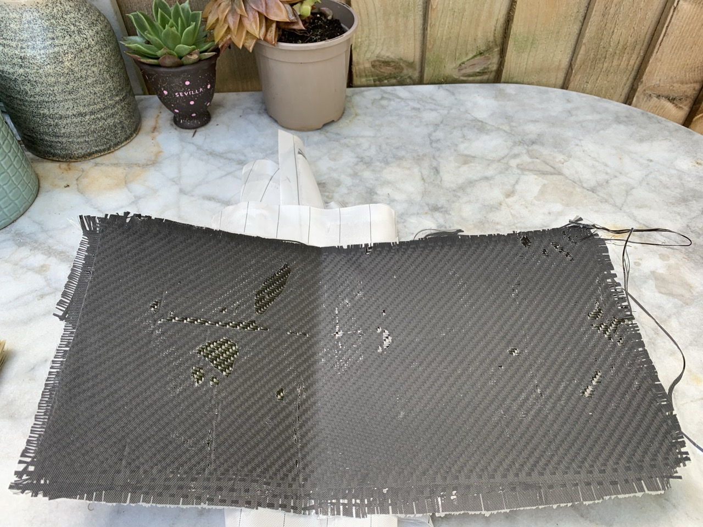

# {{ parent_child_title() }}
{{ status_banner() }}

Baseline recipe with 0/90 twill and simple taper.

## Goal
Produce a basic carbon blade using a manual wet layup.

## Specifications / Dimensions
- Uses 0/90 3K twill carbon cloth
- Geometry and taper follow the chosen cutting template

## Bill of Materials

{{ render_bill_of_materials() }}

## Tools Required
{{ render_tools_required() }}

## Reference Images

|  |  |
|-------------------------------------------|--------------------------------------------------|
| Wet Carbon Laminate                       | Cured Carbon Laminate                       |

## Instructions (step-by-step)

**0. Safety first**

- Wear **gloves** and work in a **well-ventilated area** to avoid exposure to harmful fumes.

---

**1. Prepare the work surface**

1. Pour a small amount of the **PVA mold release agent** into a cup.
2. Using a **brush**, apply the release agent **thinly and evenly** over the working surface or mold.
   - Tip: see this **[video at 2:00](https://youtu.be/neh6zDt7vD8?si=0ocFH4VtYBHPhHzH)** for guidance.

---

**2. Cut the carbon fiber cloth**

- Measure and cut the **carbon fiber cloth** to the desired dimensions.
- Ensure smooth cuts to maintain structural strength along the fiber weave.

---

**3. Prepare the epoxy resin**

1. Pour **epoxy resin** into a mixing pot.
   - Use a **ratio of 100:30 by weight** (resin:hardener).
   - Example: for **100 g of resin**, add **30 g of hardener**.
2. Use the **digital scale** for precise measurement.
3. Mix the resin and hardener thoroughly, but **gently**, to avoid introducing air bubbles.

---

**4. Lay the resin and carbon cloth**

1. Spread an even layer of **resin** directly onto the prepared mold or surface.
2. Lay the **carbon fiber cloth** over the resin layer.
3. Apply another layer of resin over the cloth using the **brush** and smooth it out with the **roller**.
   - Tip: use the roller to eliminate trapped air and ensure the **cloth adheres evenly**.

---

**5. Apply peel ply**

1. Once the laminate layers are complete, apply **two layers of peel ply** over the top surface.
   - Peel ply absorbs **excess resin** and helps achieve a uniform finish.
2. Optional: include a **breather layer** to improve vacuum results.
3. Optional: if using a vacuum bagging kit, place the prepared laminate inside one of the storage bags, seal it, and apply **vacuum pressure** with the manual pump.

---

**6. Clean-up**

1. Clean all reusable tools (e.g., brushes) with **acetone** immediately after use.
2. Discard **used gloves, cups, and mixing sticks** responsibly.

## Limitations
- Manual layup can trap more resin compared to vacuum processes.
- Work time is limited once resin is mixed; prepare all materials in advance.
