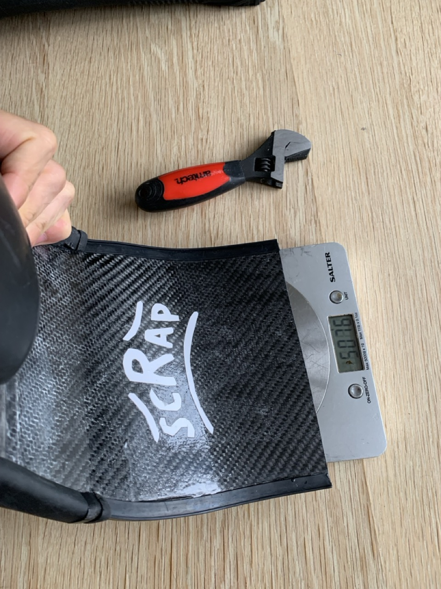

# {{ parent_child_title() }}
{{ status_banner() }}

## Goal
Measure the load required to make the **tip vertical (90°)** and observe where the blade bends (root, mid, tip).

## Reference Images

|  |  |  |
|--|---------------------------------------------|--|
|  | Kitchen Scale Test                          |  |

## Time needed

{{ render_technique_time_overview() }}

## Bill of Materials

{{ render_bill_of_materials() }}

## Tools Required
{{ render_tools_required() }}

## Instructions

Firmly hold the blade just beyond the foot pocket angle, as this is the point where bending occurs. Gradually press
until the blade tip lies flat against the kitchen scale, and note the weight reading. Repeat the process by bending the
blade in the opposite direction.

## Data to Record
- **Load required to bend the fin to 90 degrees** (Kg)

## Limitations

- Determining when the tip reaches a 90-degree angle is fairly approximate.
- Holding the root of the blade vertically is also subjective.

