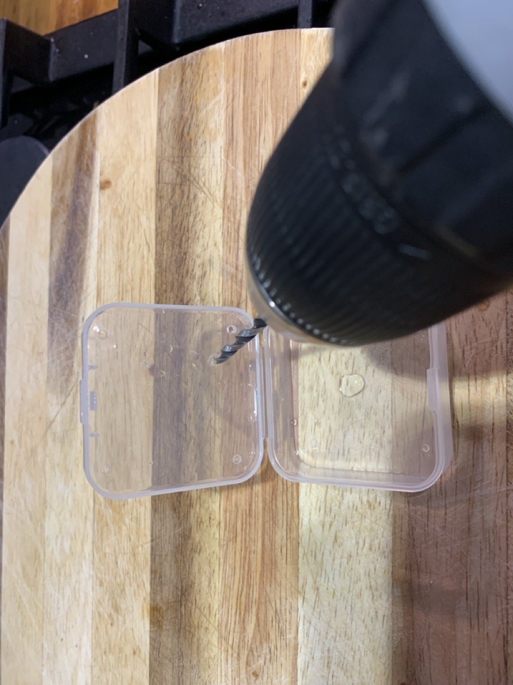
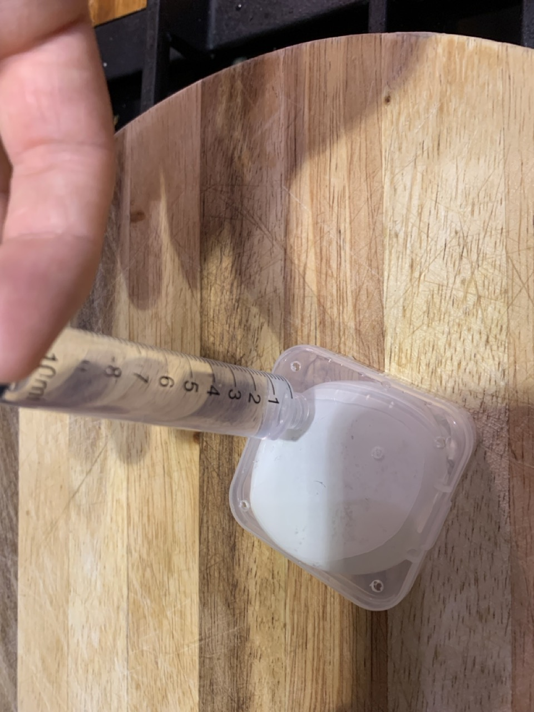
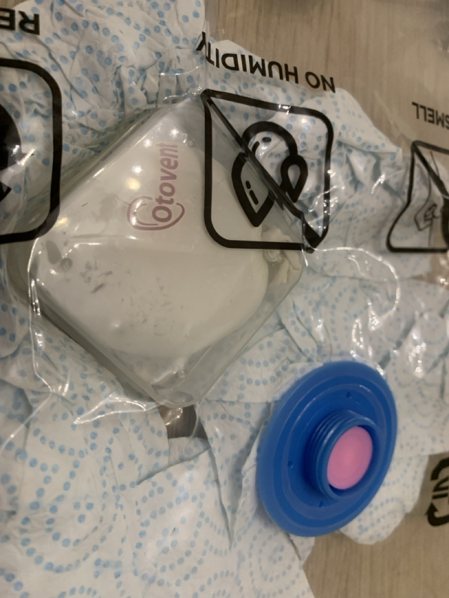
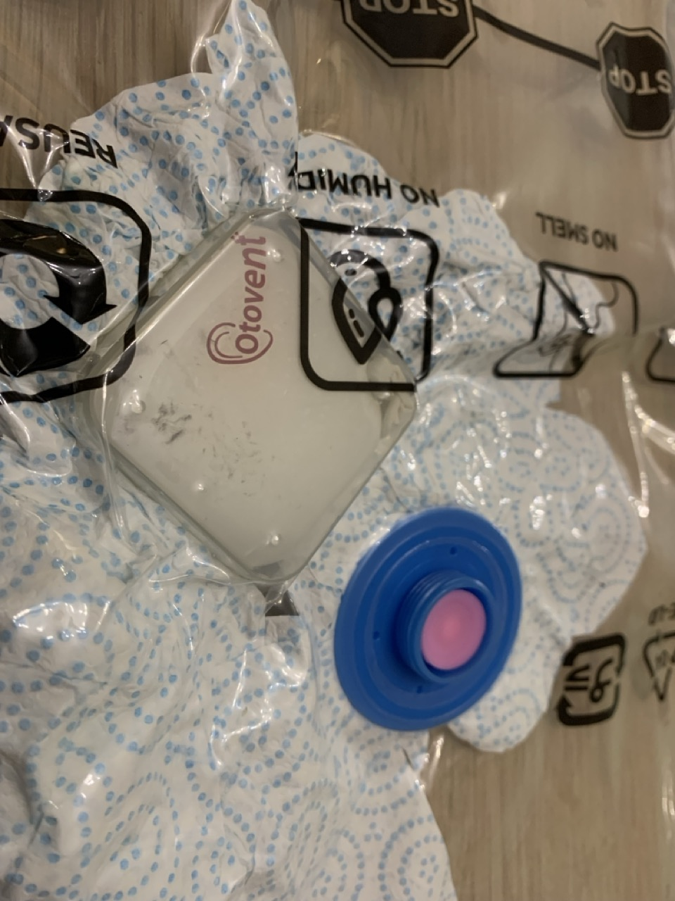

# {{ parent_child_title() }}
{{ status_banner() }}

A simple gauge to detect when the vacuum bag reaches about **80% of atmospheric pressure** (roughly a **20% vacuum**).

It relies on **Boyle’s law**, which states:

$$
P_1 V_1 = P_2 V_2
$$

As the external pressure drops slightly, the trapped air expands inside a **balloon** placed in a **rigid plastic container**.  
When the balloon expands to a known volume, it gives a simple visual cue for partial vacuum.

**Example Calculation:**

| Parameter | Symbol | Value | Notes |
|------------|:-------:|:------|-------|
| Ambient pressure | \(P_1\) | 1.0 atm | Normal atmospheric pressure |
| Balloon volume at rest | \(V_1\) | 27 mL | Container (35 mL) minus occupied volume (8 mL) |
| Target pressure (80 % of atmospheric) | \(P_2\) | 0.8 atm | Corresponds to 20 % vacuum |
| Expanded volume | \(V_2 = \dfrac{P_1 V_1}{P_2}\) | 33.75 mL | Theoretical balloon volume at 0.8 atm |
| Container volume | — | 35 mL | Balloon almost fills container |
| Vacuum indication | — | ~20 % vacuum | Balloon just touching container walls |

When the balloon **almost fills** the container (but does not press firmly against it),  
the pressure has dropped to roughly **80 % of atmospheric pressure**, or **≈0.8 atm absolute**.  
That corresponds to a modest vacuum, enough to confirm that the vacuum bag is sealed and pulling correctly.

## Goal

Detect when we've hit 80% of atmospheric pressure.

## Reference Images

|  |  |
|--------------------------------------|----------------------------------------------|
| Container with holes                 | Measure Displaced Volume                     |

|  |  |
|--------------------------------------------------------|------------------------------------------------------------|
| Trapped Balloon at atmospheric pressure                 | Trapped Balloon at 80% atmospheric pressure                 |

## Time needed

{{ render_technique_time_overview() }}

## Bill of Materials

{{ render_bill_of_materials() }}

## Tools Required

{{ render_tools_required() }}

## Instructions (step-by-step)

1. **Prepare the container**  
   Choose a small, clear plastic container with a tight-fitting lid.  
   Drill **four small holes** near the corners of the top lip to allow air to pass.  
   Drill a **larger central hole** to fit the **syringe head** snugly.  
   This will be used for measuring water volume and later for the air path.

2. **Measure the container volume**  
   Use the syringe to fill the container with water, keeping track of how many milliliters it takes until full.  
   Example: the container holds about **35 mL** of water.

3. **Inflate the balloon**  
   Partially inflate a small balloon until it fills roughly **80% of the container volume**.  
   You want it to just start touching the sides when placed inside.  
   Seal the balloon tightly with a knot or clip.

4. **Measure the balloon volume**  
   Place the sealed balloon inside the container.  
   Close the lid and use the syringe to inject water through the central hole until the container is full again.  
   The difference in water volume tells you how much air is inside the balloon.  
   Example: the container with balloon accepts **8 mL** of water, meaning the balloon’s volume is  
   $$
   V_{\text{balloon}} = 35 - 8 = 27\,\text{mL}
   $$

5. **Using the gauge**  
   Place the container **face down onto the breather cloth** inside your vacuum bag.  
   The small holes let air escape freely while allowing the balloon to expand as the pressure drops.  
   When the balloon nearly fills the container, the bag has reached about **80% of atmospheric pressure (0.8 atm)**.

---

## Limitations

- Inflating the balloon to exactly 80% of the container volume is difficult, so accuracy varies.  
- The balloon adds its own resistance to expansion, not accounted for by Boyle’s law.  
- The gauge provides only an approximate visual indication of pressure.

