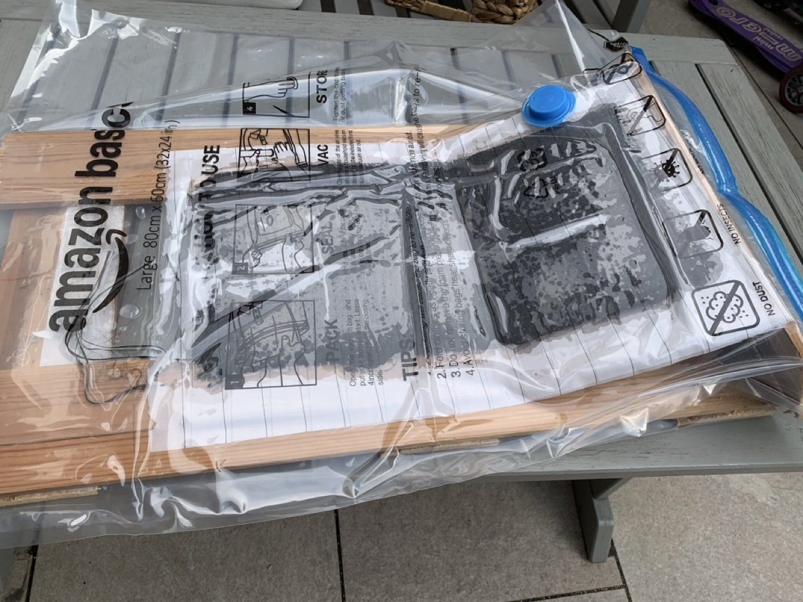

# {{ parent_child_title() }}
{{ status_banner() }}

## Goal
To create a simple, low-cost vacuum environment for small parts using the manual pump and storage bags from the vacuum bagging kit.

## Specifications / Dimensions
- Suitable for small to medium parts that fit inside standard vacuum storage bags
- Maximum part size: limited to the largest bag available
- Pressure achievable: approximately -0.2 to -0.4 bar with a manual pump
- Requires a flat, rigid base (e.g. acrylic sheet) to support the part

## Bill of Materials

{{ render_bill_of_materials() }}

## Tools Required
{{ render_tools_required() }}

## Reference Images

|          |  |          |
|----------|------------------------------------|----------|

## Instructions (step-by-step)
1. Smooth the edges of the base or part using the file to prevent puncturing the vacuum bag.
2. Place breather cloth around the part to allow airflow inside the bag.
3. Add an extra layer of breather cloth directly under the vacuum pump connector since this point receives the highest pressure.
4. Place the entire setup into the vacuum bag.
5. Seal the bag securely according to the supplier’s instructions.
6. Use the manual pump to create a vacuum. Stop when the base begins to bend slightly, ensuring enough pressure without risking deformation.
7. Check the bag after 10 minutes. If the vacuum is lost, the bag may be perforated. Replace the bag and restart the process.

## Limitations
- Requires a solid base that can be lifted and inserted into the bag
- Enclosed vacuum bagging limits the maximum part size to the bag dimensions
- If the angled part of the acrylic base bends too much under vacuum, the resulting blade might not fit into the foot pocket
